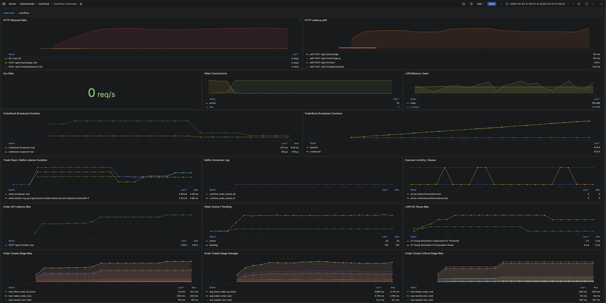

# CoinFlow Test Results

이 문서는 동시성 테스트와 k6 로컬 부하 테스트 실행 결과를 기록하기 위한 템플릿이다.

테스트 계획은 [TestPlan.md](./TestPlan.md)를 기준으로 하고, 이 문서는 실제 실행 환경과 결과를 남긴다. 결과가 없는 항목은 완료된 것처럼 채우지 않는다.

## 1. 실행 정책

| 테스트 | 실행 시점 | 목적 | 비고 |
|---|---|---|---|
| Unit / Integration | PR 전, CI | 기능 정합성 검증 | `./gradlew test` |
| Concurrency | PR 전, 필요 시 반복 | lock, 잔고, 주문 수량 불변식 검증 | timing-sensitive 테스트는 반복 실행 |
| k6 Load | 로컬 수동 실행, 기준선 갱신 시 | 주문/조회 API 응답 기준선 기록 | CI 필수 조건으로 두지 않음 |

## 2. 공통 환경 기록

| 항목 | 값 |
|---|---|
| Date | 2026-05-16 |
| Branch | `chore/32/phase1-concurrency-load-test` |
| Commit | `22ff339` + working tree |
| Java | 21 |
| Spring Boot | 3.5.x |
| DB | MySQL 8 |
| Host | local (`MacBook-Pro.local`) |
| CPU / Memory |  |
| Notes | k6 ran against local app + Docker MySQL. Local standard is Docker MySQL exposed as `3306:3306`; stop any locally installed `mysqld` that occupies port `3306`. |

## 3. JUnit / Integration

Command:

```bash
./gradlew test
```

Result:

| 항목 | 값 |
|---|---|
| Status | Passed |
| Total tests | 104 |
| Failed tests | 0 |
| Duration | 1m 19s |

Notes:

- Command completed with `BUILD SUCCESSFUL`.

## 4. Concurrency Test Results

Command:

```bash
./gradlew test --tests com.coinflow.integration.ConcurrencyIntegrationTest
```

### CON-001 동일 사용자 동시 BUY 주문

| 항목 | 값 |
|---|---|
| Status | Passed |
| Threads | 20 |
| Repeats | 10 |
| Success orders | 10 per repeat |
| Failed requests | 10 per repeat (`INSUFFICIENT_BALANCE`) |
| Final available | `0` |
| Final locked | `100000` |
| Ledger count | 10 `ORDER_LOCK` entries per repeat |
| Finding | Concurrent BUY requests did not exceed available KRW and did not create negative balances. |

### CON-002 하나의 maker 주문에 대한 동시 taker 체결

| 항목 | 값 |
|---|---|
| Status | Passed |
| Taker threads | 10 |
| Maker quantity | `0.5` |
| Total traded quantity | `0.5` per repeat |
| Maker final status | `FILLED` |
| Maker executed quantity | `0.5` |
| Maker remaining quantity | `0` |
| Finding | Concurrent taker requests did not trade more than the maker order quantity. |

### CON-003 주문 처리 중 오더북 반복 조회

| 항목 | 값 |
|---|---|
| Status | Passed |
| Writer threads | 2 |
| Reader threads | 3 |
| Read attempts | 60 per repeat |
| Exceptions | 0 |
| Finding | Orderbook reads returned HTTP 200 while concurrent order creation updated the in-memory book. |

### CON-004 주문 취소와 체결 경합

| 항목 | 값 |
|---|---|
| Status | Passed |
| Repeats | 10 |
| Final statuses observed | `CANCELED` or `FILLED` depending on race winner |
| Invariant violations | 0 |
| Finding | Cancel/fill race ended in one terminal maker state without negative wallet balances or overfilled quantity. |

## 5. k6 Load Test Results

Command:

```bash
DURATION=30s ORDER_RATE=10 QUERY_RATE=20 BUYER_COUNT=8 SELLER_COUNT=8 k6 run k6/order-flow-load-test.js
```

Date: 2026-05-18

### LOAD-001 주문 생성 중심 시나리오

| Metric | Result | Threshold |
|---|---:|---:|
| VUs | preAllocated 8 / max 20 |  |
| Duration | 30s |  |
| http_req_failed | `0.00%` | `< 1%` |
| http_req_duration p95 | `76.5ms` overall / `76.71ms` order create | `< 1000ms` |
| 5xx count | `0` | `0` |
| Created orders | `301` |  |
| Created trades | `150` |  |

Finding:

- Order creation and matching stayed within threshold with no failed HTTP requests and no 5xx responses.

### LOAD-002 조회 API 혼합 시나리오

| Metric | Result | Threshold |
|---|---:|---:|
| VUs | preAllocated 8 / max 20 |  |
| Duration | 30s |  |
| http_req_failed | `0.00%` | `< 1%` |
| http_req_duration p95 | `22.1ms` query tagged requests | `< 500ms` |
| 5xx count | `0` | `0` |

Endpoint breakdown:

| Endpoint | p95 | Error rate | Notes |
|---|---:|---:|---|
| `GET /api/v1/markets` | `16.70ms` | `0.00%` |  |
| `GET /api/v1/markets/{market}/orderbook` | `30.44ms` | `0.00%` | Highest query p95 in this run |
| `GET /api/v1/markets/{market}/trades` | `20.47ms` | `0.00%` |  |
| `GET /api/v1/wallets` | `19.69ms` | `0.00%` |  |
| `GET /api/v1/wallets/ledgers` | `30.25ms` | `0.00%` |  |
| `GET /api/v1/fills` | `13.76ms` | `0.00%` |  |

Finding:

- Query mix stayed below the 500ms p95 threshold. No failed HTTP requests or 5xx responses were observed.

## 6. Observability Smoke Results

Date: 2026-05-18

Purpose:

- Prometheus/Grafana 로컬 관측 구성이 실제 애플리케이션 메트릭을 수집하는지 확인한다.
- Docker MySQL `3306:3306` 기준에서 앱, 테스트, k6 smoke가 함께 동작하는지 확인한다.

Commands:

```bash
docker compose ps
docker compose exec -T mysql mysqladmin ping -h localhost -ucoinflow -pcoinflow
./gradlew test
DURATION=5s ORDER_RATE=2 QUERY_RATE=4 BUYER_COUNT=2 SELLER_COUNT=2 k6 run k6/order-flow-load-test.js
```

Result:

| 항목 | 값 |
|---|---|
| Docker MySQL | `coinflow-mysql-1`, `3306:3306`, `mysqld is alive` |
| Prometheus | Ready, `coinflow` target `up` |
| Grafana | `/api/health` OK |
| Gradle test | Passed |
| k6 duration | `5s` |
| k6 http_req_failed | `0.00%` |
| k6 http_req_duration p95 | `114.49ms` |
| k6 query p95 | `38.32ms` |
| k6 server_errors | `0` |
| k6 created_orders | `11` |
| k6 created_trades | `5` |
| Prometheus query | `sum(rate(http_server_requests_seconds_count[1m])) = 0.6256` |

Finding:

- Local observability stack scraped the running CoinFlow application successfully.
- Short k6 smoke generated order/query traffic without HTTP failures or 5xx responses.

## 7. Phase 1 MVP 정합성 / Soak 검증

Date: 2026-05-18

Context:

| 항목 | 값 |
|---|---|
| Issue | `#34` Phase 1 MVP 정합성 검증 |
| Branch | `test/34/phase1-mvp-integrity-tests` |
| Commit at execution | `94e7d13` |
| App | local Spring Boot, `http://localhost:8080` |
| DB | Docker MySQL 8, `3306:3306` |
| Observability | Docker Prometheus/Grafana |

### JUnit / Integration 재검증

Command:

```bash
./gradlew test --rerun-tasks
```

Result:

| 항목 | 값 |
|---|---:|
| Status | Passed |
| Total tests | `130` |
| Failed tests | `0` |
| Errors | `0` |
| Duration | `1m 36s` |

Finding:

- 공통 정합성 검증, 실패 요청 부작용 검증, 오더북 복구 검증, 동시 요청 멱등성 검증을 포함한 전체 테스트가 통과했다.

### k6 3분 Soak 테스트

Command:

```bash
k6 run -e DURATION=3m -e ORDER_RATE=10 -e QUERY_RATE=20 -e BUYER_COUNT=8 -e SELLER_COUNT=8 k6/order-flow-load-test.js
```

Scenario:

| 항목 | 값 |
|---|---:|
| Duration | `3m` |
| Order creation rate | `10 iterations/s` |
| Query mix rate | `20 iterations/s` |
| VUs | preAllocated `8 + 8`, max `20 + 20` |
| Completed iterations | `5400` |
| Interrupted iterations | `0` |

Thresholds:

| Metric | Result | Threshold |
|---|---:|---:|
| `http_req_duration` p95 | `53.95ms` | `< 1000ms` |
| `http_req_duration{type:query}` p95 | `16.69ms` | `< 500ms` |
| `http_req_failed` | `0.00%` | `< 1%` |
| `server_errors` | `0` | `0` |

Business counters:

| Metric | Result |
|---|---:|
| Created orders | `1800` |
| Created trades | `900` |
| HTTP requests | `5449` |
| Checks succeeded | `7265 / 7265` |

Endpoint latency:

| Endpoint / metric | avg | p95 | max |
|---|---:|---:|---:|
| Overall HTTP | `19.55ms` | `53.95ms` | `149.45ms` |
| Order create | `37.08ms` | `63.16ms` | `146.48ms` |
| Query tagged requests | `9.21ms` | `16.69ms` | `80.04ms` |
| `GET /api/v1/markets` | `8.91ms` | `15.62ms` | `67.03ms` |
| `GET /api/v1/markets/{market}/orderbook` | `8.24ms` | `21.26ms` | `80.04ms` |
| `GET /api/v1/markets/{market}/trades` | `10.49ms` | `15.59ms` | `33.77ms` |
| `GET /api/v1/wallets` | `10.01ms` | `15.30ms` | `65.04ms` |
| `GET /api/v1/wallets/ledgers` | `15.25ms` | `21.50ms` | `40.67ms` |
| `GET /api/v1/fills` | `7.30ms` | `11.55ms` | `31.79ms` |

Observability sample:

| Metric | Result |
|---|---:|
| Prometheus `up{job="coinflow"}` | `1` |
| Hikari active max over 10m | `1` |
| Hikari pending max over 10m | `0` |
| Heap used max over 10m | `151457072 bytes` / about `144.44 MiB` |
| GC pause max over 10m | `0.021s` |
| GC pause total over 10m | about `0.198s` |
| 5xx increase over 10m | no series observed; k6 `server_errors=0` |

Finding:

- 3분 동안 주문 생성/조회 혼합 부하가 threshold를 모두 통과했다.
- HTTP 실패율과 서버 에러는 0으로 관측됐다.
- Hikari pending connection은 0으로 유지되어 DB 커넥션 대기 병목은 보이지 않았다.
- Phase 1 MVP 기준에서는 Kafka/WebSocket 도입 전에 주문/체결/조회 API의 기본 안정성 검증이 완료된 상태로 판단했다.

## 8. Outbox Publisher / Kafka 발행 검증

Date: 2026-05-18

Context:

| 항목 | 값 |
|---|---|
| Issue | `#36` Outbox Publisher 기반 Kafka 이벤트 발행 |
| Branch | `feat/36/outbox-publisher` |
| DB | Testcontainers MySQL 8 |
| Kafka | Embedded Kafka |

Commands:

```bash
./gradlew test --tests com.coinflow.event.service.OutboxPublisherTest
./gradlew test --tests com.coinflow.integration.KafkaPublishingIntegrationTest
./gradlew test
```

Result:

| 항목 | 값 |
|---|---:|
| OutboxPublisher unit tests | Passed, `5` tests |
| Kafka publishing integration test | Passed, `1` test |
| Full regression test | Passed |
| Total tests | `136` |
| Failed tests | `0` |
| Full regression duration | `3m 1s` |

Verified scope:

- `domain_events.published=false` 이벤트를 Kafka topic으로 발행한다.
- 주문 이벤트는 `coinflow.order.events`, 체결/정산 이벤트는 `coinflow.trade.events`로 라우팅한다.
- Kafka message key는 `marketSymbol`을 사용한다.
- 발행 성공 시 `published=true`, `published_at`이 기록되고 `last_error_message`가 초기화된다.
- 발행 실패 시 주문/체결 트랜잭션과 분리되어 `publish_attempts`와 `last_error_message`만 갱신된다.
- 한 이벤트 발행 실패가 같은 배치의 다음 이벤트 발행을 막지 않는다.
- `maxAttempts` 이상 실패한 이벤트는 폴링 대상에서 제외되는 쿼리 조건을 사용한다.
- 주문 체결 후 실제 Embedded Kafka에서 `TRADE_CREATED` 메시지를 수신했다.

Finding:

- Outbox Publisher 추가 후 기존 Phase 1 정합성 테스트가 회귀 없이 통과했다.
- 이 시점에는 WebSocket consumer/broadcast를 범위에 포함하지 않고 다음 이슈로 분리했다.

## 9. WebSocket 체결 알림 검증

Date: 2026-05-18

Context:

| 항목 | 값 |
|---|---|
| Issue | `#38` Kafka Consumer 기반 WebSocket 체결 알림 |
| Branch | `feat/38/websocket-trade-feed` |
| DB | Testcontainers MySQL 8 |
| Kafka | Embedded Kafka |

Commands:

```bash
./gradlew test --tests 'com.coinflow.websocket.*'
./gradlew test --tests com.coinflow.integration.WebSocketTradeFeedIntegrationTest
./gradlew test
```

Result:

| 항목 | 값 |
|---|---:|
| WebSocket unit tests | Passed, `6` tests |
| WebSocket Kafka integration test | Passed, `1` test |
| Full regression test | Passed |
| Total tests | `143` |
| Failed tests | `0` |
| Full regression duration | `3m 16s` |

Verified scope:

- STOMP endpoint `/ws`와 simple broker `/topic`을 설정한다.
- Kafka `coinflow.trade.events` topic의 `TRADE_CREATED` 이벤트를 소비한다.
- Outbox payload를 WebSocket 체결 메시지로 변환한다.
- `takerOrderId` 기준으로 체결 side `BUY`/`SELL`을 계산한다.
- 체결 메시지를 `/topic/trades/{market}`로 broadcast한다.
- 체결 이벤트가 아닌 메시지는 broadcast하지 않는다.
- Kafka message 파싱 실패가 발생해도 listener 예외를 외부로 전파하지 않는다.
- 주문 체결 후 Outbox Publisher가 Kafka에 발행한 `TRADE_CREATED` 이벤트가 WebSocket broadcast까지 이어지는 경로를 Embedded Kafka 통합 테스트로 검증했다.

Finding:

- WebSocket 체결 피드는 주문/체결 DB 트랜잭션과 분리된 외부 전파 계층으로 추가됐다.
- 기존 Phase 1 정합성 테스트와 Outbox Publisher 검증은 회귀 없이 통과했다.
- 이 시점의 범위는 체결 feed만 포함했다. 오더북 broadcast, WebSocket 인증/권한 분리, 클라이언트 재연결 처리는 후속 범위로 두었다.

## 10. WebSocket STOMP 실제 수신 E2E 검증

Date: 2026-05-19

Context:

| 항목 | 값 |
|---|---|
| Issue | `#40` WebSocket STOMP 실제 수신 E2E 검증 |
| Branch | `feat/40/websocket-stomp-e2e` |
| DB | Testcontainers MySQL 8 |
| Kafka | Embedded Kafka |
| WebSocket client | `WebSocketStompClient` + `StandardWebSocketClient` |

Command:

```bash
./gradlew test --tests com.coinflow.integration.WebSocketStompE2eTest
./gradlew test
```

Result:

| 항목 | 값 |
|---|---:|
| STOMP E2E integration test | Passed, `1` test |
| Full regression test | Passed |
| Total tests | `144` |
| Failed tests | `0` |
| STOMP E2E duration | `19s` |
| Full regression duration | `3m 25s` |

Verified scope:

- 실제 STOMP client가 `ws://localhost:{port}/ws`에 연결한다.
- client가 `/topic/trades/BTC-KRW`를 구독한다.
- 주문 체결 후 Outbox Publisher가 Kafka `coinflow.trade.events`에 `TRADE_CREATED` 이벤트를 발행한다.
- Kafka Consumer가 체결 이벤트를 WebSocket topic으로 broadcast한다.
- STOMP client가 `TradeFeedMessage`를 수신한다.
- 수신 메시지의 `market`, `price`, `quantity`, `side`, `tradedAt`을 검증한다.

Finding:

- 기존 #38 테스트는 서버 내부 `SimpMessagingTemplate.convertAndSend()` 호출까지 검증했다.
- 이번 테스트로 실제 WebSocket 연결, STOMP 구독, Kafka 이벤트 발행, 클라이언트 수신까지 이어지는 E2E 경로를 추가 검증했다.
- 이 시점에는 오더북 broadcast, WebSocket 인증/권한, 재연결/중복 수신 처리를 후속 범위로 두었다.

## 11. WebSocket 오더북 snapshot broadcast 검증

Date: 2026-05-19

Context:

| 항목 | 값 |
|---|---|
| Issue | `#42` WebSocket 오더북 snapshot broadcast |
| Branch | `feat/42/websocket-orderbook` |
| DB | Testcontainers MySQL 8 |
| Kafka | Embedded Kafka |
| WebSocket server side | `SimpMessagingTemplate` |

Commands:

```bash
./gradlew test --tests 'com.coinflow.websocket.*'
./gradlew test --tests com.coinflow.integration.WebSocketOrderBookBroadcastIntegrationTest
./gradlew test
```

Result:

| 항목 | 값 |
|---|---:|
| OrderBook broadcaster unit tests | Passed, `3` tests |
| OrderBook Kafka integration tests | Passed, `3` tests |
| Full regression test | Passed |
| Total tests | `150` |
| Failed tests | `0` |
| OrderBook integration duration | `21s` |
| Full regression duration | `3m 37s` |

Verified scope:

- Kafka `coinflow.order.events` topic의 주문 이벤트를 소비한다.
- `ORDER_ACCEPTED`, `ORDER_PARTIALLY_FILLED`, `ORDER_FILLED`, `ORDER_CANCELED` 이벤트에서 현재 오더북 snapshot을 만든다.
- REST 오더북과 같은 `OrderBookResponse` 집계 기준을 사용해 price level을 합산한다.
- configured depth를 `1..100` 범위로 제한한다.
- 오더북 snapshot을 `/topic/orderbook/{market}`로 broadcast한다.
- 주문 생성 후 ask price level이 broadcast된다.
- 완전 체결 후 빈 오더북 snapshot이 broadcast된다.
- 주문 취소 후 빈 오더북 snapshot이 broadcast된다.
- 대상 이벤트가 아니거나 Kafka message 파싱이 실패하면 broadcast하지 않고 listener 예외를 전파하지 않는다.

Finding:

- WebSocket 외부 전파 범위가 체결 feed에서 오더북 snapshot까지 확장됐다.
- 오더북 snapshot은 DB source of truth가 아니라 인메모리 오더북 파생 상태를 전파하는 용도다.
- 기존 Phase 1 정합성 테스트와 WebSocket 체결 E2E 테스트는 회귀 없이 통과했다.
- WebSocket 인증/권한, 클라이언트 재연결/중복 수신 처리, delta orderbook streaming은 후속 범위로 둔다.

## 12. WebSocket/Kafka 실시간 전파 부하 테스트

Date: 2026-05-20

Context:

| 항목 | 값 |
|---|---|
| Issue | `#48` WebSocket/Kafka 실시간 전파 부하 테스트 |
| Branch | `test/48/websocket-kafka-load-test` |
| DB | Local Docker MySQL 8 |
| Kafka | Local Docker Kafka |
| Observability | Prometheus / Grafana |

Command:

```bash
k6 run -e WS_SUBSCRIBERS=5 -e ORDER_RATE=10 k6/websocket-kafka-load-test.js
k6 run -e WS_SUBSCRIBERS=5 -e ORDER_RATE=30 k6/websocket-kafka-load-test.js
k6 run -e WS_SUBSCRIBERS=5 -e ORDER_RATE=50 k6/websocket-kafka-load-test.js
k6 run -e WS_SUBSCRIBERS=20 -e ORDER_RATE=10 k6/websocket-kafka-load-test.js
k6 run -e WS_SUBSCRIBERS=20 -e ORDER_RATE=30 k6/websocket-kafka-load-test.js
k6 run -e WS_SUBSCRIBERS=20 -e ORDER_RATE=50 k6/websocket-kafka-load-test.js
k6 run -e WS_SUBSCRIBERS=50 -e ORDER_RATE=10 k6/websocket-kafka-load-test.js
k6 run -e WS_SUBSCRIBERS=50 -e ORDER_RATE=30 k6/websocket-kafka-load-test.js
k6 run -e WS_SUBSCRIBERS=50 -e ORDER_RATE=50 k6/websocket-kafka-load-test.js
```

Result matrix:

| WS subscribers | ORDER_RATE | Status | Created orders | Created trades | Current trade messages | OrderBook messages | Trade lag p95 | Trade lag p99 | Order create p95 | HTTP failed | 5xx |
|---:|---:|---|---:|---:|---:|---:|---:|---:|---:|---:|---:|
| 5 | 10 | PASS | 301 | 150 | 750 | 3,005 | 1.03s | 1.06s | 46.70ms | 0.00% | 0 |
| 5 | 30 | PASS | 901 | 450 | 2,250 | 9,005 | 1.08s | 1.12s | 32.59ms | 0.00% | 0 |
| 5 | 50 | FAIL | 1,500 | 750 | 2,665 | 10,670 | 13.58s | 14.22s | 24.58ms | 0.00% | 0 |
| 20 | 10 | PASS | 301 | 150 | 3,000 | 17,340 | 1.04s | 1.07s | 61.13ms | 0.00% | 0 |
| 20 | 30 | PASS | 900 | 450 | 9,000 | 36,000 | 1.30s | 1.41s | 35.85ms | 0.00% | 0 |
| 20 | 50 | FAIL | 1,500 | 750 | 10,660 | 42,680 | 14.40s | 15.06s | 25.68ms | 0.00% | 0 |
| 50 | 10 | PASS | 301 | 150 | 7,500 | 43,350 | 1.05s | 1.08s | 59.22ms | 0.00% | 0 |
| 50 | 30 | PASS | 893 | 446 | 22,300 | 89,250 | 2.10s | 2.28s | 44.05ms | 0.00% | 0 |
| 50 | 50 | FAIL | 1,501 | 750 | 26,050 | 104,200 | 14.49s | 15.11s | 29.75ms | 0.00% | 0 |

Note:

- FAIL은 API 실패가 아니라 `ws_trade_delivery_lag p95 < 3000ms` 기준 초과를 의미한다.
- `WS_SUBSCRIBERS=50`, `ORDER_RATE=30`에서는 k6 `dropped_iterations=8`이 발생했다.
- `ORDER_RATE=50` 구간은 주문 생성과 DB 정합성은 유지되지만, 40초 WebSocket subscriber window 안에서 실시간 전파가 밀린다.

Verified scope:

- STOMP client가 `/ws`에 연결한다.
- `/topic/trades/BTC-KRW`, `/topic/orderbook/BTC-KRW`를 구독한다.
- 주문 생성 부하 중 Kafka Consumer 기반 WebSocket broadcast를 수신한다.
- WebSocket handshake는 k6 setup에서 생성한 JWT를 사용해 실제 인증 사용자 흐름으로 검증한다.
- 체결 feed는 `tradedAt` 기준 수신 지연을 측정한다. 단, 로컬 Kafka/Outbox backlog로 인한 왜곡을 피하기 위해 테스트 시작 이후 생성된 trade만 latency 샘플에 포함한다.
- 오더북 snapshot은 수신 여부와 메시지 구조를 검증한다.

Grafana observations:

| 항목 | 관측 |
|---|---|
| Outbox unpublished events | `0` |
| Kafka consumer lag | `0` for `coinflow-websocket` group |
| JVM heap used max over 30m | about `269.68 MiB` (`282773992 bytes`) |
| GC pause max over 30m | `0.023s` |
| HTTP latency | Prometheus p95 over 30m about `52.58ms`; k6 order create p95 max `61.13ms` |
| Hikari connection | active max `2`, pending max `0` |
| 5xx increase over 30m | `0`; k6 `server_errors=0` |

Finding:

- WebSocket handshake, STOMP subscribe, Kafka Consumer broadcast, client receive path가 로컬 부하에서 동작했다.
- `ORDER_RATE=30`, `WS_SUBSCRIBERS=50`까지는 trade feed p95 `2.10s`, p99 `2.28s`로 기준을 통과했다.
- `ORDER_RATE=50`에서는 subscriber 수와 관계없이 trade feed p95가 `13s~14s`대로 상승했다.
- Outbox/Kafka backlog는 테스트 종료 시점에 남지 않았으므로, 병목은 영구 적체보다는 테스트 window 안에서 Kafka Consumer -> WebSocket broadcast 전파가 따라가지 못하는 구간으로 판단한다.
- HTTP 실패율과 5xx는 0이므로, 현재 한계는 주문 API 처리보다 실시간 전파 경로에 있다.
- 앱 재기동 직후 Kafka/Outbox에 과거 이벤트 backlog가 남아 있으면 첫 실행의 `ws_trade_delivery_lag`가 크게 튈 수 있다. 기준선 측정은 backlog를 비운 뒤 또는 fresh Kafka/DB 환경에서 실행한다.

## 13. WebSocket/Kafka 실시간 전파 병목 완화

Date: 2026-05-21

Context:

| 항목 | 값 |
|---|---|
| Issue | `#49` WebSocket broadcast 병목 완화 |
| Branch | `perf/49/websocket-broadcast-bottleneck` |
| DB | Local Docker MySQL 8 |
| Kafka | Local Docker Kafka |
| Observability | Prometheus / Grafana |

Changes:

- WebSocket outbound channel executor를 명시적으로 설정했다.
- trade feed / orderbook broadcast duration, sent count를 Micrometer metric으로 기록한다.
- OrderBook snapshot은 이벤트마다 즉시 전송하지 않고 market별로 짧은 window 동안 coalescing한다.
- Outbox 기본 발행 설정을 `100 events / 1000ms`에서 `500 events / 200ms`로 조정했다.

Comparison:

| Scenario | Change point | Status | Trade lag p95 | Trade lag p99 | OrderBook messages | Order create p95 | HTTP failed | 5xx |
|---|---|---|---:|---:|---:|---:|---:|---:|
| 50 subscribers / 30 order/s | Before | PASS | 2.10s | 2.28s | 89,250 | 44.05ms | 0.00% | 0 |
| 50 subscribers / 30 order/s | After orderbook coalescing | PASS | 1.81s | 1.92s | 1,400 | 40.58ms | 0.00% | 0 |
| 50 subscribers / 30 order/s | After Outbox cadence tuning | PASS | 225ms | 242ms | 6,500 | 30.59ms | 0.00% | 0 |
| 50 subscribers / 50 order/s | Before | FAIL | 14.49s | 15.11s | 104,200 | 29.75ms | 0.00% | 0 |
| 50 subscribers / 50 order/s | After orderbook coalescing | FAIL | 14.79s | 15.42s | 1,600 | 40.71ms | 0.00% | 0 |
| 50 subscribers / 50 order/s | After Outbox cadence tuning | PASS | 250ms | 261ms | 5,950 | 45.81ms | 0.00% | 0 |

Additional observations:

| 항목 | 관측 |
|---|---|
| Outbox unpublished events after run | `0` |
| Kafka consumer lag after run | `0` for `coinflow-websocket` group |
| `websocket.trade.broadcast.duration` max | `0.0032s` |
| `websocket.orderbook.broadcast.duration` max | `0.089s` |
| Hikari connection after run | active `0`, pending `0` |
| JVM GC pause max sample | `0.012s` |

Finding:

- OrderBook coalescing은 fan-out 메시지 수를 크게 줄였지만, `ORDER_RATE=50`의 trade feed 지연은 해결하지 못했다.
- `websocket.trade.broadcast.duration` 자체는 ms 이하~수 ms 수준이므로, 주 병목은 STOMP `convertAndSend`가 아니었다.
- `ORDER_RATE=50`에서는 주문/체결당 생성되는 domain event 수가 많아 기존 Outbox 설정(`100 events / 1000ms`)이 이벤트 발행 속도를 따라가지 못했다.
- Outbox 발행 주기와 batch size를 조정하자 `50 subscribers / 50 order/s`에서도 trade feed p95가 `14.49s`에서 `250ms`로 개선됐다.

## 14. WebSocket/Kafka 전파 한계 부하 측정

Date: 2026-05-21

Context:

| 항목 | 값 |
|---|---|
| Issue | `#50` WebSocket/Kafka 전파 한계 부하 측정 |
| Branch | `perf/50/websocket-kafka-load-limit` |
| DB | Local Docker MySQL 8 |
| Kafka | Local Docker Kafka |
| App run option | `DEBUG=false` |
| Notes | 셸 환경의 `DEBUG=release`로 인해 첫 실행은 Spring Boot debug logging이 활성화되어 측정값에서 제외했다. |

Scale-up result:

| Scenario | Status | Created orders | Created trades | Trade messages | OrderBook messages | Trade lag p95 | Trade lag p99 | Order create p95 | Order create p99 | Dropped iterations | HTTP failed | 5xx |
|---|---|---:|---:|---:|---:|---:|---:|---:|---:|---:|---:|---:|
| 50 subscribers / 100 order/s | FAIL | 2,882 | 1,441 | 72,050 | 3,150 | 1.23s | 1.44s | 1.64s | 1.72s | 118 | 0.00% | 0 |

Post-run observations:

| 항목 | 관측 |
|---|---|
| Outbox unpublished events | `0` |
| Kafka consumer lag | `0` for `coinflow-websocket` group |
| Hikari connection | active `0`, pending `0` |
| `websocket.trade.broadcast.duration` max | `0.0026s` |
| `websocket.orderbook.broadcast.duration` count / sum / max | `63` / `60.65s` / `1.63s` |
| Local accumulated data before/after run | users `850`, orders `33,395`, trades `16,684`, domain_events `100,131`, wallet_ledgers `100,981` |

Finding:

- `50 subscribers / 100 order/s`부터 목표 기준을 넘지 못했다.
- HTTP failure와 5xx는 0이므로 기능 실패가 아니라 지연/처리량 한계다.
- Outbox backlog와 Kafka consumer lag는 남지 않았다.
- `websocket.trade.broadcast.duration`은 낮으므로 trade feed 전송 자체가 주 병목은 아니다.
- `websocket.orderbook.broadcast.duration`이 높게 나타났다. 오더북 snapshot broadcast가 market lock을 잡고 snapshot을 만들면서 주문 생성 경로와 경합하는 것으로 판단한다.
- 따라서 `100/100`, `100/200`, `200/200` 구간은 같은 병목을 더 크게 만들 가능성이 높아 이번 실행에서는 중단한다.

Next action:

- 오더북 snapshot broadcast가 주문 생성 market lock을 오래 잡지 않도록 구조를 개선한다.
- 후보:
  - Kafka Consumer에서 직접 DB snapshot을 만들지 않고, 커밋 후 반영된 in-memory orderbook 기준으로 snapshot 생성
  - broadcast용 snapshot 생성 lock 범위 축소
  - orderbook snapshot을 full snapshot이 아니라 delta 또는 bounded depth cache로 전환
  - 성능 테스트 전용 fresh DB/Kafka 환경을 구성해 누적 데이터 영향을 제거

## 15. 오더북 브로드캐스트 락 경합 완화

Date: 2026-05-21

Context:

| 항목 | 값 |
|---|---|
| Issue | `#51` 오더북 브로드캐스트 락 경합 완화 |
| Branch | `perf/51/orderbook-broadcast-lock-contention` |
| DB | Local Docker MySQL 8 |
| Kafka | Local Docker Kafka |
| App run option | `DEBUG=false` |

Changes:

- WebSocket 오더북 브로드캐스트에서 `OrderService` market lock 의존을 제거했다.
- `MemoryOrderBook`에 synchronized snapshot API를 추가해 buy/sell side를 짧은 오더북 내부 lock 범위에서 함께 복사한다.
- REST 오더북 조회도 동일한 `MatchingEngine.snapshot()` 경로를 사용하도록 변경했다.
- `websocket.orderbook.snapshot.duration` metric을 추가해 snapshot 생성 시간을 별도로 측정한다.

Verification:

```bash
./gradlew test --tests 'com.coinflow.websocket.*'
./gradlew test --tests com.coinflow.integration.WebSocketOrderBookBroadcastIntegrationTest --tests com.coinflow.query.QueryApiTest
./gradlew test
k6 run -e RUN_ID=lockfix2-50-100-a -e DURATION=30s -e WS_WARMUP=5s -e WS_SUBSCRIBERS=50 -e ORDER_RATE=100 -e ORDER_VUS=40 -e ORDER_MAX_VUS=200 -e BUYER_COUNT=50 -e SELLER_COUNT=50 k6/websocket-kafka-load-test.js
```

Result:

| 항목 | 결과 |
|---|---:|
| WebSocket unit tests | Passed |
| OrderBook broadcast / Query API targeted tests | Passed |
| Full regression test | Passed |
| k6 scenario status | FAIL: `order_create_duration p95 < 1000ms` 초과 |
| HTTP failed | `0.00%` |
| 5xx | `0` |

Before / after comparison:

| Scenario | Change point | Created orders | Created trades | Trade lag p95 | Trade lag p99 | Order create p95 | Order create p99 | Dropped iterations | OrderBook broadcast max | OrderBook snapshot max |
|---|---|---:|---:|---:|---:|---:|---:|---:|---:|---:|
| 50 subscribers / 100 order/s | Before `#51` | 2,882 | 1,441 | 1.23s | 1.44s | 1.64s | 1.72s | 118 | 1.63s | - |
| 50 subscribers / 100 order/s | After lock contention fix | 2,917 | 1,458 | 290ms | 302ms | 1.22s | 1.29s | 84 | 0.0040s | 0.00047s |

Capture correlation 기준:

| 구분 | 값 |
|---|---|
| Before capture range | `2026-05-22 14:33:30 ~ 14:35:10 KST` |
| After capture range | `2026-05-22 14:53:00 ~ 14:54:15 KST` |
| Before k6 summary | `/private/tmp/k6-before-orderbook-lock-rerun.json` |
| After k6 summary | `/private/tmp/k6-after-orderbook-lock-rerun.json` |
| Before Prometheus scrape | `/private/tmp/coinflow-metrics-before-rerun.txt` |
| After Prometheus scrape | `/private/tmp/coinflow-metrics-after-rerun.txt` |

동일 조건 재측정:

| Scenario | Change point | Created orders | Created trades | Trade lag p95 | Trade lag p99 | Order create p95 | Order create p99 | Dropped iterations | OrderBook broadcast count / sum / max | OrderBook snapshot max |
|---|---|---:|---:|---:|---:|---:|---:|---:|---:|---:|
| 50 subscribers / 100 order/s | Before `#51` | 2,712 | 1,356 | 2.012s | 2.219s | 2.434s | 2.466s | 289 | 54 / 60.617s / 2.4019s | - |
| 50 subscribers / 100 order/s | After lock contention fix | 2,523 | 1,261 | 284ms | 309ms | 2.806s | 3.078s | 478 | 114 / 0.044s / 0.0044s | 0.00056s |

동일 조건 재측정 해석:

- `websocket.orderbook.broadcast.duration`은 sum `60.617s -> 0.044s`, max `2.4019s -> 0.0044s`로 감소했다.
- `ws_trade_delivery_lag` p95는 `2.012s -> 284ms`로 감소했다.
- Outbox unpublished event, Kafka consumer lag, Hikari pending connection은 before/after 모두 `0`으로 확인했다.
- 주문 생성 p95는 `2.434s -> 2.806s`로 개선되지 않았다. 따라서 after 재측정 기준의 주문 생성 지연은 오더북 broadcast lock 경합만으로 설명하지 않는다.
- 후속 분석 범위는 성능 테스트 전용 fresh DB/Kafka 환경 구성, market lock 보유 시간, DB pessimistic lock 대기, 트랜잭션 hold time 계측으로 분리한다.

Post-run observations:

| 항목 | 관측 |
|---|---:|
| Outbox unpublished events | `0` |
| Kafka consumer lag | `0` for `coinflow-websocket` group |
| Hikari connection | active `0`, pending `0` |
| `websocket.trade.broadcast.duration` count / sum / max | `1458` / `0.292s` / `0.0028s` |
| `websocket.orderbook.broadcast.duration` count / sum / max | `107` / `0.0298s` / `0.0040s` |
| `websocket.orderbook.snapshot.duration` count / sum / max | `107` / `0.0055s` / `0.00047s` |
| JVM GC pause max sample | `0.007s` |

Finding:

- 오더북 snapshot broadcast의 market lock 경합은 제거된 것으로 판단한다.
- `websocket.orderbook.broadcast.duration` max가 `1.63s`에서 `0.0040s`로 감소했다.
- `websocket.orderbook.snapshot.duration` max는 `0.00047s`로 측정되어 snapshot 생성 자체는 병목으로 보이지 않는다.
- trade feed p95는 `1.23s`에서 `290ms`로 개선됐다.
- 주문 생성 p95는 `1.64s`에서 `1.22s`로 개선됐으나, `1s` 기준은 아직 초과한다.
- Outbox backlog, Kafka consumer lag, Hikari pending은 모두 0으로 관측됐다.
- 다음 병목은 WebSocket/Kafka 전파가 아니라 주문 생성 경로의 per-market 직렬화, DB pessimistic lock, 트랜잭션 hold time으로 분리한다.

Next action:

- 주문 생성 경로의 market lock 보유 시간과 DB lock 대기 시간을 계측한다.
- 매칭 계획 생성, DB 정산, 인메모리 오더북 반영 구간별 시간을 분리한다.
- 같은 `50 subscribers / 100 order/s` 조건에서 order create p95 `1s` 미만 달성을 목표로 재측정한다.

## 16. 주문 생성 경로 단계별 계측

Date: 2026-05-22

Context:

| 항목 | 값 |
|---|---|
| Issue | `#52` 주문 생성 경로 lock/transaction 병목 계측 |
| Branch | `perf/52/order-create-lock-metrics` |
| DB | Local Docker MySQL 8 |
| Kafka | Local Docker Kafka |
| App run option | `DEBUG=false` |
| Prometheus target | `up{job="coinflow"} = 1` |
| Grafana capture | `.docs/images/order-transaction-begin-bottleneck.png` |

Changes:

- 주문 생성 경로에 `order.create.stage.duration` Micrometer timer를 추가했다.
- `market_lock_wait`, `market_lock_hold`, `transaction_template`, `taker_wallet_lock`, `maker_order_lock`, `settlement_wallet_lock`, `matching_plan`, `settlement`, `orderbook_after_commit`, `total` 구간을 분리했다.
- Grafana에 `Order Create Stage Max`, `Order Create Stage Average`, `Order Create Lock Stage Max` 패널을 추가했다.

Verification:

```bash
./gradlew test
WS_SUBSCRIBERS=50 ORDER_RATE=100 DURATION=30s ORDER_VUS=20 ORDER_MAX_VUS=80 BUYER_COUNT=20 SELLER_COUNT=20 k6 run k6/websocket-kafka-load-test.js
```

Note:

- 첫 k6 실행은 샌드박스 네트워크 제한으로 `operation not permitted`가 발생하여 측정값에서 제외했다.
- 권한 허용 후 동일 조건으로 재실행한 결과만 유효 측정으로 기록한다.

Result:

| 항목 | 결과 |
|---|---:|
| Full regression test | Passed |
| k6 scenario status | FAIL: `order_create_duration p95 < 1000ms` 초과 |
| HTTP failed | `0.00%` |
| 5xx | `0` |
| Checks | `300,899 / 300,899` passed |
| Created orders | `2,744` |
| Created trades | `1,372` |
| Dropped iterations | `256` |
| WebSocket connections | `50` |
| Trade messages | `68,600` |
| OrderBook messages | `5,200` |
| Trade delivery lag p95 / p99 | `289ms` / `309ms` |
| Order create p95 / p99 | `1.00s` / `1.19s` |
| HTTP request p95 / p99 | `993.02ms` / `1.19s` |

Order create stage max:

| stage | max |
|---|---:|
| `total` | `1.2448s` |
| `market_lock_wait` | `1.2319s` |
| `market_lock_hold` | `55.33ms` |
| `transaction_template` | `55.33ms` |
| `transaction_callback` | `50.71ms` |
| `settlement` | `47.02ms` |
| `client_order_id_check` | `13.24ms` |
| `taker_wallet_lock` | `12.48ms` |
| `settlement_wallet_lock` | `12.02ms` |
| `order_save` | `9.14ms` |
| `order_lock_ledger_save` | `7.36ms` |
| `maker_order_lock` | `6.17ms` |
| `sequence_lock` | `6.15ms` |
| `orderbook_after_commit` | `1.75ms` |
| `matching_plan` | `0.58ms` |
| `self_trade_check` | `0.10ms` |

Finding:

- 기능 실패 없이 주문 생성, 체결, WebSocket trade/orderbook 전파가 동작했다.
- WebSocket trade delivery lag p95는 `289ms`로 기준을 만족했다.
- 주문 생성 p95는 `1.00s`로 임계값을 초과했고, `dropped_iterations`가 `256` 발생했다.
- `total max 1.2448s` 중 `market_lock_wait max 1.2319s`가 대부분을 차지했다.
- `transaction_template max 55.33ms`, `settlement max 47.02ms`, `orderbook_after_commit max 1.75ms`로 측정되어 DB 정산, 체결 저장, 오더북 반영은 주 병목으로 보이지 않는다.
- 현재 병목은 동일 market 주문을 단일 lock으로 직렬화하는 구조의 대기 시간으로 판단한다.

Next action:

- market 단일 lock 범위 축소 가능성을 검토한다.
- 주문 생성 경로에서 market sequence 발급, taker 주문 저장, matching/settlement의 직렬화 필요 범위를 분리한다.
- 동일 조건에서 `market_lock_wait`와 `order_create_duration p95` 감소 여부를 재측정한다.

## 17. 주문 생성 market lock 범위 축소 재측정

Date: 2026-05-22

Context:

| 항목 | 값 |
|---|---|
| Issue | `#57` 주문 생성 market lock 범위 축소 |
| Branch | `perf/57/order-create-lock-scope` |
| DB | Local Docker MySQL 8 |
| Kafka | Local Docker Kafka |
| App run option | `DEBUG=false` |
| Prometheus target | `up{job="coinflow"} = 1` |
| Before capture | `.docs/images/order-create-lock-scope-before-5m.png` |
| After capture | `.docs/images/order-create-lock-scope-after-5m.png` |

Changes:

- `clientOrderId` 사전 중복 조회를 market lock 밖으로 이동했다.
- DB unique constraint 기반 중복 방어를 `DataIntegrityViolationException` 매핑으로 보강했다.
- market lock release를 transaction `afterCompletion`으로 명시해 DB commit 및 `afterCommit` 오더북 반영 이후에만 해제한다.
- `applyMatchPlan`은 기존과 같이 `afterCommit`에서 수행해 DB commit 전 인메모리 오더북 반영을 방지한다.

Verification:

```bash
./gradlew test
WS_SUBSCRIBERS=50 ORDER_RATE=100 DURATION=5m ORDER_VUS=40 ORDER_MAX_VUS=160 BUYER_COUNT=40 SELLER_COUNT=40 k6 run k6/websocket-kafka-load-test.js
```

Result:

| 항목 | Before | After |
|---|---:|---:|
| Full regression test | - | Passed |
| k6 scenario status | FAIL: `order_create_duration p95 < 1000ms` 초과 | FAIL: `order_create_duration p95 < 1000ms` 초과 |
| HTTP failed | `0.00%` | `0.00%` |
| 5xx | `0` | `0` |
| Checks | `2,136,781 / 2,136,781` passed | `2,669,609 / 2,669,609` passed |
| Created orders | `18,805` | `25,419` |
| Created trades | `9,402` | `12,709` |
| Actual order throughput | `56.56 order/s` | `76.80 order/s` |
| Dropped iterations | `11,196` | `4,582` |
| WebSocket connections | `50` | `50` |
| Trade messages | `470,100` | `635,450` |
| OrderBook messages | `54,600` | `19,150` |
| Trade delivery lag p95 / p99 / max | `279ms` / `297ms` / `345ms` | `2.20s` / `3.35s` / `5.37s` |
| Order create p95 / p99 / max | `2.88s` / `3.15s` / `3.48s` | `2.63s` / `3.57s` / `7.35s` |
| HTTP request p95 / p99 / max | `2.87s` / `3.15s` / `3.48s` | `2.62s` / `3.57s` / `7.35s` |
| Kafka consumer lag | `0` | `0` |

Order create stage max:

| stage | Before max | After max |
|---|---:|---:|
| `total` | `3.0575s` | `5.1223s` |
| `market_lock_wait` | `3.0458s` | `397.38ms` |
| `market_lock_hold` | `56.01ms` | `82.66ms` |
| `transaction_template` | `56.00ms` | `3.7715s` |
| `transaction_callback` | `42.65ms` | `411.56ms` |
| `settlement` | `35.93ms` | `69.79ms` |
| `taker_wallet_lock` | `12.48ms` | `29.79ms` |
| `settlement_wallet_lock` | `14.26ms` | `14.03ms` |
| `sequence_lock` | `10.49ms` | `18.52ms` |
| `client_order_id_check` | `11.62ms` | `16.38ms` |
| `order_lock_ledger_save` | `10.79ms` | `20.98ms` |
| `order_save` | `10.21ms` | `10.92ms` |
| `maker_order_lock` | `9.51ms` | `8.37ms` |
| `orderbook_after_commit` | `0.64ms` | `1.32ms` |
| `matching_plan` | `0.61ms` | `0.48ms` |
| `self_trade_check` | `0.16ms` | `0.32ms` |

Finding:

- WebSocket/Kafka 전파 경로는 5분 부하에서도 유실 없이 동작했다.
- 주문 실패, 5xx, STOMP error, WebSocket connection error는 모두 0으로 관측됐다.
- Kafka consumer lag는 0으로 유지되어 이벤트 전파 backlog는 병목으로 보지 않는다.
- `market_lock_wait max`는 `3.0458s`에서 `397.38ms`로 감소했다.
- 실제 주문 처리량은 `56.56 order/s`에서 `76.80 order/s`로 증가했다.
- `dropped_iterations`는 `11,196`에서 `4,582`로 감소했다.
- 개선 후 `transaction_template max`가 `3.7715s`까지 상승해 DB connection pool 대기 또는 트랜잭션 점유 시간이 다음 병목으로 판단된다.
- 100 order/s를 5분 유지하는 조건에서는 아직 p95 1초 기준을 통과하지 못했다.

Next action:

- 주문 생성 트랜잭션 내부 DB 접근 순서와 connection 점유 시간을 줄인다.
- 정산 저장, 원장 저장, 이벤트 저장을 포함한 transaction scope를 재검토한다.
- 성능 테스트 전용 fresh DB/Kafka 환경에서 동일 조건을 재측정한다.

## 18. 주문 생성 트랜잭션 단계 계측 재측정

Date: 2026-05-23

Context:

| 항목 | 값 |
|---|---|
| Issue | `#58` 주문 생성 트랜잭션 점유 시간 병목 분석 |
| Branch | `perf/58/order-transaction-duration-analysis` |
| DB | Local Docker MySQL 8 |
| Kafka | Local Docker Kafka |
| App run option | `DEBUG=false` |
| Prometheus target | `up{job="coinflow"} = 1` |

Changes:

- `transaction_template` 내부를 transaction lifecycle 단계로 분리했다.
- transaction callback 진입 전 대기, commit, afterCommit callback, afterCompletion callback 구간을 별도 stage로 계측했다.
- Grafana `Order Create Critical Stage Max` 패널에 transaction phase 지표를 추가했다.

Verification:

```bash
./gradlew test
WS_SUBSCRIBERS=50 ORDER_RATE=100 DURATION=5m ORDER_VUS=40 ORDER_MAX_VUS=160 BUYER_COUNT=40 SELLER_COUNT=40 k6 run k6/websocket-kafka-load-test.js
```

Result:

| 항목 | 결과 |
|---|---:|
| Full regression test | Passed |
| k6 scenario status | FAIL: `order_create_duration p95 < 1000ms` 초과 |
| HTTP failed | `0.00%` |
| 5xx | `0` |
| Checks | `2,774,919 / 2,774,919` passed |
| Created orders | `26,374` |
| Created trades | `13,187` |
| Actual order throughput | `79.66 order/s` |
| Dropped iterations | `3,626` |
| WebSocket connections | `50` |
| Trade messages | `659,350` |
| OrderBook messages | `21,100` |
| Trade delivery lag p95 / p99 / max | `1.44s` / `1.70s` / `2.36s` |
| Order create p95 / p99 / max | `2.14s` / `2.67s` / `3.95s` |
| HTTP request p95 / p99 / max | `2.14s` / `2.66s` / `3.95s` |
| Kafka consumer lag | `0` |
| Hikari active max over 10m | `10` |
| Hikari pending max over 10m | `149` |
| JVM GC pause max over 10m | `13ms` |

Order create stage max:

| stage | max |
|---|---:|
| `total` | `3.5791s` |
| `transaction_template` | `2.4026s` |
| `transaction_begin` | `2.2790s` |
| `transaction_callback` | `323.82ms` |
| `market_lock_wait` | `307.68ms` |
| `market_lock_hold` | `135.11ms` |
| `transaction_commit` | `90.33ms` |
| `transaction_after_callback` | `90.46ms` |
| `settlement` | `87.06ms` |
| `sequence_lock` | `64.28ms` |
| `order_lock_ledger_save` | `32.39ms` |
| `maker_order_lock` | `32.12ms` |
| `settlement_wallet_lock` | `32.09ms` |
| `client_order_id_check` | `24.74ms` |
| `order_save` | `14.54ms` |
| `taker_wallet_lock` | `10.67ms` |
| `orderbook_after_commit` | `0.13ms` |

Finding:

- 새 transaction phase 계측으로 `transaction_template` 지연의 주 구간이 `transaction_begin`임을 확인했다.
- `transaction_begin max 2.2790s`는 transaction callback 진입 전 대기 시간이므로, 실제 주문 비즈니스 로직보다 DB connection 획득/transaction begin 대기 가능성이 높다.
- 같은 10분 window에서 Hikari active max는 pool 기본 상한인 `10`, pending max는 `149`로 관측됐다.
- Kafka consumer lag, 5xx, WebSocket/STOMP error는 모두 0으로 유지됐다.
- `transaction_callback max 323.82ms`, `market_lock_wait max 307.68ms`, `commit max 90.33ms`로 관측되어 callback 내부보다 connection pool 대기가 더 큰 병목으로 판단한다.

Next action:

- Hikari maximum pool size를 환경 변수로 조정 가능하게 만들고, `10 / 20 / 30` 단계별로 동일 조건을 재측정한다.
- pool size 증가만으로 해결되는지, DB lock/commit 시간이 함께 증가하는지 Grafana에서 확인한다.
- transaction callback 내부의 market lock hold time과 settlement time이 pool 증설 후 새 병목으로 이동하는지 확인한다.

## 19. Hikari pool size별 주문 생성 지연 재측정

Date: 2026-05-24

Context:

| 항목 | 값 |
|---|---|
| Issue | `#61` Hikari pool size별 주문 생성 지연 재측정 |
| Branch | `perf/61/hikari-pool-order-latency` |
| DB | Local Docker MySQL 8 |
| Kafka | Local Docker Kafka |
| App run option | `DEBUG=false` |
| Grafana capture | `.docs/images/hikari-pool-order-latency.png` |

Changes:

- Hikari maximum pool size 실행 옵션화
  - `spring.datasource.hikari.maximum-pool-size=${DB_POOL_MAX_SIZE:10}`
- pool size `10 / 20 / 30` 동일 조건 재측정
- Hikari pending, `transaction_begin`, order create latency 상관관계 비교

Verification:

```bash
./gradlew test

DB_POOL_MAX_SIZE=10 ./gradlew bootRun
WS_SUBSCRIBERS=50 ORDER_RATE=100 DURATION=5m ORDER_VUS=40 ORDER_MAX_VUS=160 BUYER_COUNT=40 SELLER_COUNT=40 k6 run k6/websocket-kafka-load-test.js

DB_POOL_MAX_SIZE=20 ./gradlew bootRun
WS_SUBSCRIBERS=50 ORDER_RATE=100 DURATION=5m ORDER_VUS=40 ORDER_MAX_VUS=160 BUYER_COUNT=40 SELLER_COUNT=40 k6 run k6/websocket-kafka-load-test.js

DB_POOL_MAX_SIZE=30 ./gradlew bootRun
WS_SUBSCRIBERS=50 ORDER_RATE=100 DURATION=5m ORDER_VUS=40 ORDER_MAX_VUS=160 BUYER_COUNT=40 SELLER_COUNT=40 k6 run k6/websocket-kafka-load-test.js
```

Result:

| Pool size | Created orders | Throughput | Dropped iterations | Order p95 | Order p99 | Order max | Trade lag p95 | HTTP failed / 5xx |
|---:|---:|---:|---:|---:|---:|---:|---:|---:|
| `10` | `28,692` | `86.76 order/s` | `1,308` | `1.83s` | `2.15s` | `3.14s` | `1.19s` | `0.00% / 0` |
| `20` | `29,702` | `89.60 order/s` | `298` | `1.52s` | `1.84s` | `3.23s` | `833ms` | `0.00% / 0` |
| `30` | `27,867` | `84.86 order/s` | `2,133` | `2.11s` | `2.88s` | `5.73s` | `1.08s` | `0.00% / 0` |

Prometheus max:

| Pool size | Hikari active | Hikari pending | `transaction_begin` | `transaction_callback` | `transaction_commit` | `market_lock_wait` | `market_lock_hold` | Kafka lag | GC pause |
|---:|---:|---:|---:|---:|---:|---:|---:|---:|---:|
| `10` | `10` | `147` | `1.7874s` | `325.20ms` | `56.02ms` | `318.91ms` | `89.39ms` | `0` | `8ms` |
| `20` | `20` | `136` | `1.8384s` | `462.98ms` | `81.58ms` | `455.92ms` | `100.50ms` | `0` | `12ms` |
| `30` | `30` | `129` | `3.2505s` | `1.1779s` | `110.03ms` | `1.1366s` | `301.75ms` | `0` | `11ms` |

Finding:

- Hikari pending은 pool size 증가에 따라 `147 -> 136 -> 129`로 감소.
- order create p95와 dropped iterations 기준 최적 후보는 pool size `20`.
- pool size `30`에서 `transaction_begin`, `transaction_callback`, `market_lock_wait`, `market_lock_hold` 동반 악화.
- 단순 pool 증설은 connection 대기 일부 완화 효과만 확인.
- pool size 과증설 시 DB lock/market lock 경합과 transaction callback 지연이 신규 병목으로 이동.
- Kafka consumer lag, WebSocket/STOMP error, 5xx는 모든 구간에서 0 유지.
- `50 subscribers / 100 order/s / 5m` 조건에서 p95 1초 기준은 미달성.

Decision:

- 로컬 기준 Hikari maximum pool size 후보값은 `20`.
- 다음 개선 방향은 pool 추가 증설이 아니라 transaction callback 내부 DB lock/market lock 경합 완화.
- 주문 생성 트랜잭션 점유 시간 축소 및 settlement/write path 분리 검토.

## 20. 주문 생성 트랜잭션 내부 DB 경합 분석

Date: 2026-05-25

Context:

| 항목 | 값 |
|---|---|
| Issue | `#64` 주문 생성 트랜잭션 내부 DB 경합 분석 |
| Branch | `perf/64/order-transaction-db-contention` |
| DB | Local Docker MySQL 8 |
| Kafka | Local Docker Kafka |
| Hikari pool size | `20` |
| App run option | `DEBUG=false` |
| Grafana capture | `.docs/images/order-transaction-db-contention.png` |

Changes:

- `transaction_callback` 내부 DB 작업을 세부 stage로 분리했다.
- 주문 접수 event 저장, trade 저장, settlement event 저장, ledger 저장, wallet mutation, dust cancel 구간을 별도 계측했다.
- Grafana `Order Create Critical Stage Max` 패널에 신규 stage를 추가했다.
- `.docs/TestPlan.md`에 stage 정의와 병목 판단 기준을 반영했다.

Verification:

```bash
./gradlew test

DB_POOL_MAX_SIZE=20 DEBUG=false ./gradlew bootRun
WS_SUBSCRIBERS=50 ORDER_RATE=100 DURATION=5m ORDER_VUS=40 ORDER_MAX_VUS=160 BUYER_COUNT=40 SELLER_COUNT=40 k6 run k6/websocket-kafka-load-test.js
```

Result:

| 항목 | 결과 |
|---|---:|
| Full regression test | Passed |
| k6 scenario status | FAIL: `order_create_duration p95 < 1000ms` 초과 |
| HTTP failed | `0.00%` |
| 5xx | `0` |
| Checks | `3,035,729 / 3,035,729` passed |
| Created orders | `28,779` |
| Created trades | `14,389` |
| Actual order throughput | `87.55 order/s` |
| Dropped iterations | `1,222` |
| WebSocket connections | `50` |
| Trade messages | `719,450` |
| OrderBook messages | `25,000` |
| Trade delivery lag p95 / p99 / max | `1.02s` / `1.25s` / `1.73s` |
| Order create p95 / p99 / max | `1.91s` / `2.16s` / `3.17s` |
| HTTP request p95 / p99 / max | `1.91s` / `2.15s` / `3.17s` |
| Kafka consumer lag | `0` |
| Hikari active max over 1h | `20` |
| Hikari pending max over 1h | `139` |
| JVM GC pause max over 1h | `11ms` |

Order create stage max:

| stage | max |
|---|---:|
| `total` | `2.7544s` |
| `transaction_template` | `1.9470s` |
| `transaction_begin` | `1.7400s` |
| `transaction_callback` | `381.10ms` |
| `market_lock_wait` | `377.54ms` |
| `market_lock_hold` | `53.15ms` |
| `settlement` | `32.87ms` |
| `transaction_after_callback` | `25.64ms` |
| `transaction_commit` | `25.36ms` |
| `settlement_wallet_lock` | `19.66ms` |
| `order_lock_ledger_save` | `15.69ms` |
| `client_order_id_check` | `13.95ms` |
| `settlement_completed_event_save` | `12.22ms` |
| `settlement_ledger_save` | `11.37ms` |
| `taker_wallet_lock` | `10.81ms` |
| `settlement_trade_event_save` | `10.84ms` |
| `order_save` | `9.62ms` |
| `order_accepted_event_save` | `8.07ms` |
| `maker_order_lock` | `7.97ms` |
| `sequence_lock` | `7.10ms` |
| `trade_save` | `6.54ms` |
| `settlement_wallet_mutation` | `0.03ms` |
| `settlement_order_fill` | `0.03ms` |
| `orderbook_after_commit` | `0.07ms` |

Finding:

- `transaction_template max 1.9470s` 중 `transaction_begin max 1.7400s`가 가장 큰 비중을 차지한다.
- `transaction_callback max 381.10ms`는 대부분 `market_lock_wait max 377.54ms`와 같은 수준으로 관측됐다.
- 새로 분리한 DB write 구간은 `settlement_ledger_save 11.37ms`, `settlement_trade_event_save 10.84ms`, `trade_save 6.54ms`, `order_accepted_event_save 8.07ms` 수준이다.
- 체결 계산과 wallet entity mutation은 각각 `0.03ms` 수준으로 병목 후보에서 제외한다.
- Kafka consumer lag, 5xx, WebSocket/STOMP error는 0으로 유지됐다.
- Hikari pending max는 `139`로 남아 있어 connection 대기 압력은 유지된다.

Decision:

- `transaction_callback` 내부 DB write 자체는 현재 주문 생성 p95 지연의 주 병목이 아니다.
- 잔여 병목은 `transaction_begin` 대기와 callback 내부 `market_lock_wait`로 분리한다.
- 다음 개선은 settlement write 최적화보다 주문 생성 트랜잭션 진입 대기와 market lock 대기 완화에 우선순위를 둔다.

## 21. 주문 생성 DB lock wait 병목 분석

Date: 2026-05-25

Context:

| 항목 | 값 |
|---|---|
| Issue | `#66` 주문 생성 DB lock wait 병목 분석 |
| Branch | `perf/66/order-db-lock-wait-analysis` |
| DB | Local Docker MySQL 8 |
| Kafka | Local Docker Kafka |
| Hikari pool size | `20` |
| MySQL snapshot | `/private/tmp/coinflow-mysql-lock-wait/issue66-50ws-100rps-5m-20260525-214027` |

Grafana evidence:



Measurement scope:

- `transaction_begin` 지연 원인 후보 분리
- Hikari pending과 MySQL 내부 lock wait 동시 관측
- Kafka/WebSocket 전파 구간과 주문 생성 DB 병목 구간 분리

Verification:

```bash
./gradlew test

# terminal 1
DB_POOL_MAX_SIZE=20 DEBUG=false ./gradlew bootRun

# terminal 2
RUN_ID=issue66-50ws-100rps-5m \
INTERVAL_SECONDS=2 \
DURATION_SECONDS=330 \
scripts/mysql-lock-wait-snapshot.sh

# terminal 3
WS_SUBSCRIBERS=50 ORDER_RATE=100 DURATION=5m ORDER_VUS=40 ORDER_MAX_VUS=160 BUYER_COUNT=40 SELLER_COUNT=40 k6 run k6/websocket-kafka-load-test.js
```

Result:

| 항목 | 결과 |
|---|---:|
| Full regression test | Passed |
| k6 scenario status | FAIL: `order_create_duration p95 < 1000ms` 초과 |
| HTTP failed | `0.00%` |
| 5xx | `0` |
| Checks | `2,624,567 / 2,624,567` passed |
| Created orders | `24,898` |
| Created trades | `12,449` |
| Actual order throughput | `75.15 order/s` |
| Dropped iterations | `5,102` |
| Order create p95 / p99 / max | `2.31s` / `2.76s` / `4.50s` |
| Trade delivery lag p95 / p99 / max | `1.44s` / `1.70s` / `2.79s` |
| Kafka consumer lag | `0` |
| Hikari active max | `20` |
| Hikari pending max | `140` |
| JVM GC pause max | `11ms` |

MySQL snapshot summary:

| 항목 | 결과 |
|---|---:|
| `performance_schema.data_lock_waits` max | `0` |
| `performance_schema.data_locks` max | `420` |
| `information_schema.innodb_trx` max | `20` |
| `innodb_trx` `LOCK WAIT` max | `0` |
| `Innodb_row_lock_waits` delta | `0` |
| `Innodb_row_lock_time` delta | `0ms` |
| 주요 waiting table/index | 없음 |
| 주요 blocking table/index | 없음 |

Order create stage max:

| stage | max |
|---|---:|
| `total` | `4.5023s` |
| `transaction_template` | `2.7541s` |
| `transaction_begin` | `2.4967s` |
| `transaction_callback` | `666.95ms` |
| `market_lock_wait` | `657.22ms` |
| `market_lock_hold` | `153.39ms` |
| `transaction_commit` | `108.66ms` |
| `settlement` | `77.22ms` |
| `settlement_wallet_lock` | `52.82ms` |
| `settlement_trade_event_save` | `41.60ms` |
| `settlement_ledger_save` | `33.73ms` |

Top SQL digest:

| SQL digest | Count | Total | Avg |
|---|---:|---:|---:|
| `COMMIT` | `26,696` | `32.083s` | `1.202ms` |
| `INSERT wallet_ledgers` | `74,774` | `10.283s` | `0.138ms` |
| `UPDATE domain_events` | `74,694` | `9.692s` | `0.130ms` |
| `INSERT domain_events` | `74,694` | `9.671s` | `0.129ms` |
| `UPDATE wallets` | `74,774` | `8.961s` | `0.120ms` |
| `INSERT orders` | `24,898` | `5.137s` | `0.206ms` |
| `UPDATE orders` | `24,898` | `5.021s` | `0.202ms` |
| `SELECT order_sequences FOR UPDATE` | `24,898` | `3.345s` | `0.134ms` |

Decision:

- MySQL row lock wait는 관측되지 않았다.
- `data_lock_waits`, `innodb_trx LOCK WAIT`, `Innodb_row_lock_waits`는 모두 `0`으로 유지됐다.
- Hikari active는 pool 상한 `20`에 도달했고 pending은 `140`까지 증가했다.
- `transaction_begin max 2.4967s`가 `transaction_template max 2.7541s`의 대부분을 차지했다.
- `transaction_callback max 666.95ms` 중 `market_lock_wait max 657.22ms`가 가장 큰 비중을 차지했다.
- 트랜잭션 callback 내부 DB write와 MySQL row lock wait는 주요 병목에서 제외한다.
- 현재 병목은 트랜잭션 진입 후 market lock 대기 때문에 DB connection이 점유되고, 후속 요청이 Hikari pending으로 밀리는 구조로 판단한다.
- 다음 개선 방향은 market lock 획득을 DB transaction 시작 전으로 이동해 market 직렬화 대기가 DB connection을 점유하지 않도록 분리하는 것이다.

## 22. 주문 생성 market lock 트랜잭션 범위 분리

Date: 2026-05-26

Context:

| 항목 | 값 |
|---|---|
| Issue | `#68` 주문 생성 market lock 트랜잭션 범위 분리 |
| Branch | `perf/68/order-market-lock-before-transaction` |
| DB | Local Docker MySQL 8 |
| Kafka | Local Docker Kafka |
| Hikari pool size | `20` |
| Measurement window | `2026-05-26 12:18:30 ~ 12:25:00 KST` |
| Grafana capture | `.docs/images/order-market-lock-before-transaction-grafana.png` |

Measurement scope:

- market lock 획득 시점을 `transactionTemplate.execute` 이전으로 이동
- market 직렬화 대기와 DB connection 점유 구간 분리
- 동일 조건에서 #66 결과와 비교

Verification:

```bash
./gradlew test

DB_POOL_MAX_SIZE=20 DEBUG=false ./gradlew bootRun

WS_SUBSCRIBERS=50 ORDER_RATE=100 DURATION=5m DB_POOL_MAX_SIZE=20 ORDER_VUS=40 ORDER_MAX_VUS=160 BUYER_COUNT=40 SELLER_COUNT=40 k6 run k6/websocket-kafka-load-test.js
```

Result:

| 항목 | #66 Before | #68 After |
|---|---:|---:|
| Full regression test | Passed | Passed |
| k6 scenario status | FAIL: `order_create_duration p95 < 1000ms` 초과 | FAIL: `order_create_duration p95 < 1000ms` 초과 |
| HTTP failed | `0.00%` | `0.00%` |
| 5xx | `0` | `0` |
| Created orders | `24,898` | `23,838` |
| Created trades | `12,449` | `11,919` |
| Actual order throughput | `75.15 order/s` | `72.13 order/s` |
| Dropped iterations | `5,102` | `6,163` |
| Order create p95 / p99 / max | `2.31s` / `2.76s` / `4.50s` | `2.25s` / `2.43s` / `2.56s` |
| Trade delivery lag p95 / p99 / max | `1.44s` / `1.70s` / `2.79s` | `283ms` / `297ms` / `378ms` |
| Kafka consumer lag | `0` | `0` |
| Hikari active max | `20` | `2` |
| Hikari pending max | `140` | `0` |
| JVM GC pause max | `11ms` | `5ms` |

Order create stage max:

| stage | #66 Before | #68 After |
|---|---:|---:|
| `total` | `4.5023s` | `2.57s` |
| `transaction_template` | `2.7541s` | `103.53ms` |
| `transaction_begin` | `2.4967s` | `42.12ms` |
| `transaction_callback` | `666.95ms` | `95.40ms` |
| `market_lock_wait` | `657.22ms` | `2.56s` |
| `market_lock_hold` | `153.39ms` | `144ms` |
| `transaction_commit` | `108.66ms` | `57.42ms` |
| `settlement` | `77.22ms` | `90.20ms` |
| `settlement_wallet_lock` | `52.82ms` | `52.25ms` |
| `settlement_trade_event_save` | `41.60ms` | `36.13ms` |
| `settlement_ledger_save` | `33.73ms` | `23.76ms` |

Decision:

- market lock 대기 중 DB connection을 점유하던 구조는 제거됐다.
- Hikari active max는 `20 -> 2`, pending max는 `140 -> 0`으로 감소했다.
- `transaction_begin max`는 `2.4967s -> 42.12ms`, `transaction_template max`는 `2.7541s -> 103.53ms`로 감소했다.
- 주문 생성 전체 지연은 DB connection 대기가 아니라 transaction 시작 전 `market_lock_wait max 2.56s`로 이동했다.
- 주문 처리량과 dropped iterations는 개선되지 않았으므로, 현재 병목은 단일 market 기준 주문 생성 직렬화 자체로 분리한다.
- 다음 개선은 market 단일 lock 구조를 유지한 미세 조정보다 매칭/정산 직렬화 범위 재설계 또는 시장/가격 레벨 단위 병렬화 가능성 검토가 우선이다.

## 23. 단일 market 주문 처리량 한계 측정

Date: 2026-05-27

Context:

| 항목 | 값 |
|---|---|
| Issue | `#69` 단일 market 주문 처리량 한계 측정 |
| Branch | `perf/69/single-market-throughput-limit` |
| DB | Local Docker MySQL 8 |
| Kafka | Local Docker Kafka |
| Hikari pool size | `20` |

Measurement scope:

- market lock을 DB transaction 밖으로 이동한 상태에서 단일 market 주문 생성 처리량 한계 측정
- `50 / 70 / 90 / 100 order/s` 단계별 동일 조건 부하 테스트
- WebSocket subscribers `50`, duration `5m`, buyer/seller `40/40` 유지

Verification:

```bash
DB_POOL_MAX_SIZE=20 DEBUG=false ./gradlew bootRun

WS_SUBSCRIBERS=50 ORDER_RATE=50 DURATION=5m DB_POOL_MAX_SIZE=20 ORDER_VUS=40 ORDER_MAX_VUS=160 BUYER_COUNT=40 SELLER_COUNT=40 k6 run k6/websocket-kafka-load-test.js
WS_SUBSCRIBERS=50 ORDER_RATE=70 DURATION=5m DB_POOL_MAX_SIZE=20 ORDER_VUS=40 ORDER_MAX_VUS=160 BUYER_COUNT=40 SELLER_COUNT=40 k6 run k6/websocket-kafka-load-test.js
WS_SUBSCRIBERS=50 ORDER_RATE=90 DURATION=5m DB_POOL_MAX_SIZE=20 ORDER_VUS=40 ORDER_MAX_VUS=160 BUYER_COUNT=40 SELLER_COUNT=40 k6 run k6/websocket-kafka-load-test.js
WS_SUBSCRIBERS=50 ORDER_RATE=100 DURATION=5m DB_POOL_MAX_SIZE=20 ORDER_VUS=40 ORDER_MAX_VUS=160 BUYER_COUNT=40 SELLER_COUNT=40 k6 run k6/websocket-kafka-load-test.js
```

Result:

| ORDER_RATE | Status | Created orders | Order-window throughput | Dropped iterations | Order create p95 / p99 / max | Trade lag p95 / p99 / max | HTTP failed / 5xx | WS/STOMP errors |
|---:|---|---:|---:|---:|---:|---:|---:|---:|
| `50/s` | PASS | `15,001` | `50.00 order/s` | `0` | `32.99ms` / `74.11ms` / `166.17ms` | `252ms` / `270ms` / `420ms` | `0.00%` / `0` | `0` |
| `70/s` | FAIL: p95 threshold | `20,903` | `69.68 order/s` | `97` | `1.67s` / `1.95s` / `2.40s` | `270ms` / `291ms` / `457ms` | `0.00%` / `0` | `0` |
| `90/s` | FAIL: p95 threshold, VU saturation | `23,164` | `77.21 order/s` | `3,837` | `2.29s` / `2.68s` / `3.56s` | `283ms` / `299ms` / `492ms` | `0.00%` / `0` | `0` |
| `100/s` | FAIL: p95 threshold, VU saturation | `24,206` | `80.69 order/s` | `5,795` | `2.23s` / `2.39s` / `2.67s` | `283ms` / `299ms` / `368ms` | `0.00%` / `0` | `0` |

Grafana captures:

- Full range: `.docs/images/single-market-throughput-limit-full.png`
- Saturation range: `.docs/images/single-market-throughput-limit-saturation.png`

Decision:

- `50 order/s`는 order create p95 `32.99ms`, dropped iteration `0`으로 안정 구간이다.
- `70 order/s`부터 order create p95가 `1.67s`로 상승하고 dropped iteration이 발생해 latency 기준 안정 구간을 벗어난다.
- `90 order/s`와 `100 order/s`는 order VU가 상한에 도달하고 dropped iteration이 크게 증가해 포화 구간이다.
- 단일 market 현재 구조의 안정 처리 기준은 `50 order/s`, latency 기준 임계 구간은 `70 order/s` 부근으로 분리한다.
- 부하 구간 전체에서 HTTP failed, 5xx, WebSocket/STOMP error는 0으로 유지됐다.
- 다음 개선 대상은 API 오류나 Kafka/WebSocket 전파가 아니라 단일 market 주문 직렬화 구조다.

## 24. 단일 market 주문 생성 병목 분석 및 개선

Date: 2026-05-27

Context:

| 항목 | 값 |
|---|---|
| Issue | `#74` 단일 market 주문 생성 병목 분석 및 개선 |
| Branch | `perf/74/single-market-order-bottleneck` |
| DB | Local Docker MySQL 8 |
| Kafka | Local Docker Kafka |
| Hikari pool size | `20` |

Measurement scope:

- `#71` 단일 market 주문 직렬화 병목 완화 이후 처리량 한계 재측정
- `70 / 90 / 100 / 120 order/s` 단계별 동일 조건 부하 테스트
- WebSocket subscribers `50`, duration `5m`, buyer/seller `40/40` 유지
- `90 order/s` 구간 병목 개선 실험 추가
  - 계측 Timer 캐싱
  - domain_events / wallet_ledgers JDBC batch insert
  - MySQL `rewriteBatchedStatements=true`

Verification:

```bash
DB_POOL_MAX_SIZE=20 DEBUG=false ./gradlew bootRun

WS_SUBSCRIBERS=50 ORDER_RATE=70 DURATION=5m DB_POOL_MAX_SIZE=20 ORDER_VUS=40 ORDER_MAX_VUS=160 BUYER_COUNT=40 SELLER_COUNT=40 k6 run k6/websocket-kafka-load-test.js
WS_SUBSCRIBERS=50 ORDER_RATE=90 DURATION=5m DB_POOL_MAX_SIZE=20 ORDER_VUS=40 ORDER_MAX_VUS=160 BUYER_COUNT=40 SELLER_COUNT=40 k6 run k6/websocket-kafka-load-test.js
WS_SUBSCRIBERS=50 ORDER_RATE=100 DURATION=5m DB_POOL_MAX_SIZE=20 ORDER_VUS=40 ORDER_MAX_VUS=160 BUYER_COUNT=40 SELLER_COUNT=40 k6 run k6/websocket-kafka-load-test.js
WS_SUBSCRIBERS=50 ORDER_RATE=120 DURATION=5m DB_POOL_MAX_SIZE=20 ORDER_VUS=40 ORDER_MAX_VUS=160 BUYER_COUNT=40 SELLER_COUNT=40 k6 run k6/websocket-kafka-load-test.js
```

Result:

| ORDER_RATE | Status | Created orders | Order-window throughput | Dropped iterations | Order create p95 / p99 / max | Trade lag p95 / p99 / max | HTTP failed / 5xx | WS/STOMP errors |
|---:|---|---:|---:|---:|---:|---:|---:|---:|
| `70/s` | PASS: p95 threshold | `20,968` | `69.89 order/s` | `33` | `435.68ms` / `835.63ms` / `1.10s` | `271ms` / `293ms` / `434ms` | `0.00%` / `0` | `0` |
| `90/s` | FAIL: p95 threshold, VU saturation | `26,406` | `88.02 order/s` | `595` | `1.98s` / `2.30s` / `3.17s` | `290ms` / `307ms` / `409ms` | `0.00%` / `0` | `0` |
| `100/s` | FAIL: p95 threshold, VU saturation | `27,543` | `91.81 order/s` | `2,458` | `2.10s` / `2.52s` / `2.76s` | `291ms` / `309ms` / `417ms` | `0.00%` / `0` | `0` |
| `120/s` | FAIL: p95 threshold, VU saturation | `26,369` | `87.90 order/s` | `9,632` | `2.23s` / `2.50s` / `3.60s` | `292ms` / `311ms` / `552ms` | `0.00%` / `0` | `0` |

### 24-1. 개선 실험 결과

Verification:

```bash
./gradlew test --rerun-tasks

WS_SUBSCRIBERS=50 ORDER_RATE=90 DURATION=5m DB_POOL_MAX_SIZE=20 ORDER_VUS=40 ORDER_MAX_VUS=160 BUYER_COUNT=40 SELLER_COUNT=40 k6 run k6/websocket-kafka-load-test.js
WS_SUBSCRIBERS=50 ORDER_RATE=100 DURATION=5m DB_POOL_MAX_SIZE=20 ORDER_VUS=40 ORDER_MAX_VUS=160 BUYER_COUNT=40 SELLER_COUNT=40 k6 run k6/websocket-kafka-load-test.js
```

Verification result:

| 항목 | 결과 |
|---|---:|
| `./gradlew test --rerun-tasks` | Passed |
| Duration | `2m 12s` |

Result:

| Case | ORDER_RATE | Status | Created orders | Order-window throughput | Dropped iterations | Order create p95 / p99 / max | Trade lag p95 / p99 / max | HTTP failed / 5xx | WS/STOMP errors |
|---|---:|---|---:|---:|---:|---:|---:|---:|---:|
| Before `#74` | `90/s` | FAIL: p95 threshold | `26,406` | `88.02 order/s` | `595` | `1.98s` / `2.30s` / `3.17s` | `290ms` / `307ms` / `409ms` | `0.00%` / `0` | `0` |
| Timer cache only | `90/s` | FAIL: p95 threshold, VU saturation | `26,235` | `87.45 order/s` | `766` | `1.98s` / `2.29s` / `2.95s` | `291ms` / `309ms` / `454ms` | `0.00%` / `0` | `0` |
| JDBC batch insert | `90/s` | PASS: p95 threshold | `26,997` | `89.99 order/s` | `3` | `216.87ms` / `301.10ms` / `1m22s` | `287ms` / `310ms` / `4.06s` | `0.00%` / `0` | `0` |
| JDBC batch insert | `100/s` | FAIL: p95 threshold, VU saturation | `20,163` | `67.21 order/s` | `9,838` | `3.26s` / `3.63s` / `4.00s` | `308ms` / `341ms` / `451ms` | `0.00%` / `0` | `0` |

Stage metrics after JDBC batch insert:

| Stage | Max |
|---|---:|
| `market_lock_wait` | `3.6211s` |
| `market_lock_hold` | `131.20ms` |
| `transaction_template` | `131.21ms` |
| `transaction_begin` | `8.63ms` |
| `transaction_callback` | `89.16ms` |
| `settlement` | `54.08ms` |
| `settlement_ledger_save` | `10.88ms` |
| `settlement_events_save` | `7.97ms` |
| `order_lock_ledger_save` | `11.03ms` |
| Hikari pending | `0` |

Grafana captures:

| 구간 | Time range | File |
|---|---|---|
| 전체 비교 | `2026-05-27 17:50:00 ~ 18:16:00` | `images/single-market-order-bottleneck-full.png` |
| `90 order/s` 개선 후 | `2026-05-27 17:50:00 ~ 18:06:00` | `images/single-market-order-bottleneck-90rps.png` |
| `100 order/s` 잔여 병목 | `2026-05-27 18:09:00 ~ 18:15:00` | `images/single-market-order-bottleneck-100rps.png` |

Decision:

- `#71` 이후 `70 order/s`는 order create p95 `435.68ms`로 latency 기준을 통과했다.
- `70 order/s`에서도 dropped iteration `33`이 남아 완전 무손실 안정 기준으로 보기는 어렵다.
- `90 order/s`부터 order create p95가 `1s`를 초과하고 VU saturation이 발생한다.
- `100 / 120 order/s`는 실제 처리량이 `90 order/s` 전후에서 수렴하고 dropped iteration이 증가한다.
- 계측 Timer 캐싱만으로는 `90 order/s` 구간의 p95와 dropped iteration이 개선되지 않았다.
- domain_events와 wallet_ledgers를 JDBC batch insert로 전환한 뒤 `90 order/s`는 order create p95 `216.87ms`, dropped iteration `3`으로 latency 기준을 통과했다.
- `90 order/s` 개선 후에도 `100 order/s`는 order create p95 `3.26s`, dropped iteration `9,838`로 포화 구간이다.
- Hikari pending은 `0`, transaction begin max는 `8.63ms`로 유지되어 DB connection 대기는 주요 병목에서 제외한다.
- 부하 구간 전체에서 HTTP failed, 5xx, WebSocket/STOMP error는 0으로 유지됐다.
- trade delivery lag p95는 `300ms` 이하로 유지되어 실시간 전파 구간은 주요 병목에서 제외한다.
- 다음 개선 대상은 WebSocket/Kafka 전파가 아니라 단일 market 주문 생성 hot path 내부의 lock hold와 직렬화 처리량이다.

## 25. 단일 market 100 order/s 부분 개선 및 잔여 병목

Date: 2026-05-27

Context:

| 항목 | 값 |
|---|---|
| Issue | `#76` 단일 market 100 order/s 병목 분석 및 처리량 개선 |
| Branch | `perf/76/single-market-100rps-optimization` |
| DB | Local Docker MySQL 8 |
| Kafka | Local Docker Kafka |
| Hikari pool size | `20` |

Measurement scope:

- `50 WS subscribers / 100 order/s / 5m` 조건 재측정
- 주문 생성 hot path 내부 DB round-trip 축소
  - 체결 주문의 `ORDER_ACCEPTED` 이벤트를 settlement event batch에 포함
  - 체결 주문의 `ORDER_LOCK` 원장을 settlement ledger batch에 포함
- 잔고, 체결, 원장, 도메인 이벤트 정합성 검증
- WebSocket/Kafka 전파 지표 악화 여부 확인

Verification:

```bash
./gradlew test

DB_POOL_MAX_SIZE=20 DEBUG=false ./gradlew bootRun
WS_SUBSCRIBERS=50 ORDER_RATE=100 DURATION=5m DB_POOL_MAX_SIZE=20 ORDER_VUS=40 ORDER_MAX_VUS=160 BUYER_COUNT=40 SELLER_COUNT=40 k6 run k6/websocket-kafka-load-test.js
```

Verification result:

| 항목 | 결과 |
|---|---:|
| `./gradlew test` | Passed |
| Duration | `2m 17s` |

Result:

| Case | ORDER_RATE | Status | Created orders | Order-window throughput | Dropped iterations | Order create p95 / p99 / max | Trade lag p95 / p99 / max | HTTP failed / 5xx | WS/STOMP errors |
|---|---:|---|---:|---:|---:|---:|---:|---:|---:|
| Baseline rerun | `100/s` | FAIL: p95 threshold, VU saturation | `28,627` | `95.42 order/s` | `1,373` | `1.72s` / `1.80s` / `1.90s` | `302ms` / `320ms` / `354ms` | `0.00%` / `0` | `0` |
| Event/ledger batch merge | `100/s` | FAIL: p95 threshold, VU saturation | `29,217` | `97.39 order/s` | `783` | `1.80s` / `1.96s` / `2.16s` | `312ms` / `331ms` / `394ms` | `0.00%` / `0` | `0` |

Stage metrics after event/ledger batch merge:

| Stage | Max | Average |
|---|---:|---:|
| `market_lock_wait` | `2.1488s` | `1.0627s` |
| `market_lock_hold` | `121.03ms` | `10.25ms` |
| `transaction_template` | `121.07ms` | `10.28ms` |
| `transaction_callback` | `65.43ms` | `6.81ms` |
| `settlement` | `55.26ms` | `3.94ms` |
| `transaction_commit` | `88.54ms` | `3.07ms` |
| `settlement_events_save` | `21.13ms` | `1.05ms` |
| `settlement_ledger_save` | `14.58ms` | `1.00ms` |
| Hikari pending | `0` | - |

Grafana captures:

| 구간 | Time range | File |
|---|---|---|
| Baseline rerun | `2026-05-27 19:18:40 ~ 19:24:20` | `images/single-market-100rps-before.png` |
| Event/ledger batch merge | `2026-05-27 19:33:30 ~ 19:39:30` | `images/single-market-100rps-after.png` |

Decision:

- 체결 주문 이벤트/원장 저장 batch 병합 후 created orders는 `28,627`에서 `29,217`로 증가했다.
- dropped iterations는 `1,373`에서 `783`으로 감소했다.
- order create p95는 `1.80s`로 목표 기준 `1s`를 통과하지 못했다.
- Hikari pending, HTTP failed, 5xx, WebSocket/STOMP error, Kafka lag는 주요 병목에서 제외한다.
- `market_lock_hold` 평균이 `10.25ms`로 유지되어 단일 market `100 order/s` 조건에서 직렬 처리 한계에 근접한다.
- `market_lock_wait` 평균이 `1.0627s`로 남아 있으며, 잔여 병목은 DB connection 대기가 아니라 단일 market 주문 생성 직렬화 대기로 분리한다.
- 추가 DB write batch만으로는 p95 목표 달성이 어렵다. 다음 개선은 market lock 내부에서 반드시 직렬화해야 하는 구간과 DB 정산 구간을 분리하는 구조 검토가 필요하다.

## 26. 발견 이슈

| ID | Severity | Symptom | Suspected cause | Action |
|---|---|---|---|---|
| WS-001 | MAJOR | `ORDER_RATE=50`에서 trade feed p95가 `13s~14s`대로 상승 | Outbox 발행 주기/배치가 domain event 생성 속도를 따라가지 못함 | `#49`에서 Outbox cadence 조정 후 p95 `250ms`로 개선 |
| WS-002 | MAJOR | `50 subscribers / 100 order/s`에서 orderbook broadcast max `1.63s`, trade lag p95 `1.23s` | OrderBook snapshot broadcast가 market lock을 잡고 주문 생성 경로와 경합 | `#51`에서 market lock 의존 제거 후 orderbook broadcast max `0.0040s`, trade lag p95 `290ms`로 개선 |
| ORD-001 | MAJOR | `50 subscribers / 100 order/s`에서 order create p95가 `1s`로 남고 dropped iteration `256` 발생 | `market_lock_wait max 1.2319s`; 동일 market 주문 직렬화 대기 | `#57`에서 clientOrderId 조회를 market lock 밖으로 이동 |
| ORD-002 | MAJOR | `50 subscribers / 100 order/s / 5m`에서 order create p95 `2.63s`, dropped iteration `4,582` 발생 | `transaction_template max 3.7715s`, Hikari pending 상승 | 주문 생성 transaction scope 및 DB connection 점유 시간 축소 |
| ORD-003 | MAJOR | transaction phase 계측 후 order create p95 `2.14s`, Hikari pending max `149` 발생 | `transaction_begin max 2.2790s`; DB connection 획득/transaction begin 대기 | `#61`에서 pool size `10 / 20 / 30` 단계별 측정 |
| ORD-004 | MAJOR | pool size `30`에서 order create p95 `2.11s`, dropped iteration `2,133`으로 악화 | 과도한 DB connection 동시성으로 transaction callback, market lock 경합 증가 | transaction callback 내부 DB lock/market lock 경합 완화 |
| ORD-005 | MAJOR | pool size `20`에서 order create p95 `1.91s`, dropped iteration `1,222` 유지 | `transaction_begin max 1.7400s`, `market_lock_wait max 377.54ms`; 내부 DB write stage는 수십 ms 이하 | transaction begin 대기와 market lock wait 분리 개선 |
| ORD-006 | MAJOR | `50 subscribers / 100 order/s / 5m`에서 order create p95 `2.31s`, dropped iteration `5,102`, Hikari pending max `140` 발생 | MySQL row lock wait 미관측. transaction callback 진입 후 market lock 대기로 DB connection 점유 | market lock 획득을 DB transaction 시작 전으로 이동 |
| ORD-007 | MAJOR | `market_lock_wait`를 transaction 밖으로 이동 후 Hikari pending은 `0`이지만 order create p95 `2.25s`, dropped iteration `6,163` 유지 | DB connection 대기가 아니라 단일 market 주문 직렬화 대기 | 매칭/정산 직렬화 범위 재설계 또는 market lock 분할 검토 |
| ORD-008 | MAJOR | 단일 market `70 order/s`부터 p95 `1.67s`, `90 order/s`부터 VU saturation 및 dropped iteration 증가 | 단일 market 주문 생성 직렬화 처리량 한계 | 매칭/정산 직렬화 범위 축소 또는 market lock 분할 검토 |
| ORD-009 | MAJOR | `#71` 이후 `70 order/s`는 p95 기준 통과, `90 order/s`부터 p95 `1.98s`와 dropped iteration `595` 발생 | 단일 market 주문 처리량 한계가 `70~90 order/s` 사이에 위치 | `#74`에서 domain_events / wallet_ledgers JDBC batch insert 적용 |
| ORD-010 | MAJOR | `#74` 이후 `90 order/s`는 p95 `216.87ms`로 통과했지만, `100 order/s`는 p95 `3.26s`, dropped iteration `9,838` 발생 | 단일 market hot path 처리량 한계가 `90~100 order/s` 사이에 위치 | lock hold 추가 축소 또는 매칭/정산 직렬화 범위 재검토 |
| ORD-011 | MAJOR | `#76` batch 병합 후 `100 order/s` created orders와 dropped iteration은 개선됐지만 p95 `1.80s` 유지 | 평균 `market_lock_hold 10.25ms`로 단일 market `100 order/s` 직렬 처리 한계 도달 | market lock 내부 직렬화 필수 구간과 DB 정산 구간 분리 검토 |

Severity:

- `BLOCKER`: 잔고 음수, 주문 수량 초과 체결, 데이터 불일치
- `MAJOR`: 5xx, lock timeout, 반복 가능한 성능 병목
- `MINOR`: 문서/로그/테스트 안정성 개선

## 27. 후속 조치

| Action | Owner | Status | Link |
|---|---|---|---|
| Add Prometheus/Grafana local observability compose |  | DONE |  |
| Run longer k6 soak test after observability setup |  | DONE |  |
| Add Outbox Publisher Kafka event publishing |  | DONE |  |
| Add Kafka Consumer WebSocket trade feed |  | DONE |  |
| Add WebSocket STOMP receive E2E test |  | DONE |  |
| Add WebSocket orderbook snapshot broadcast |  | DONE |  |
| Add WebSocket/Kafka realtime propagation load test |  | DONE |  |
| Expand WebSocket/Kafka propagation load baseline |  | DONE |  |
| Reduce WebSocket/Kafka propagation bottleneck |  | DONE |  |
| Measure WebSocket/Kafka propagation load limit |  | DONE |  |
| Reduce orderbook broadcast lock contention |  | DONE |  |
| Measure order creation lock contention |  | DONE |  |
| Reduce market lock wait contention |  | DONE |  |
| Measure order transaction lifecycle bottleneck |  | DONE |  |
| Tune order DB connection pool capacity |  | DONE |  |
| Measure transaction callback internal DB contention |  | DONE |  |
| Measure MySQL DB lock wait bottleneck |  | DONE |  |
| Move market lock acquisition before transaction start |  | DONE |  |
| Measure single market throughput limit |  | DONE |  |
| Reduce matched order event/ledger write round trips |  | DONE |  |
| Reduce order transaction hold time |  | PARTIAL |  |
| Redesign order creation serialization scope |  | TODO |  |
