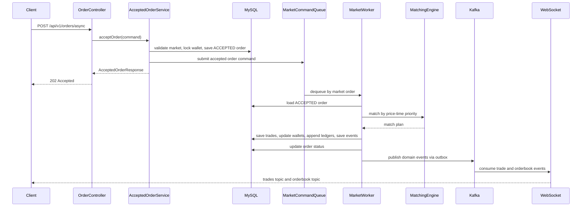

# CoinFlow

거래 정합성을 우선한 암호화폐 거래소 코어를 구현하고, k6/Prometheus/Grafana 기반 부하 테스트로 Kafka/WebSocket 전파와 주문 생성 병목을 단계적으로 분리한 백엔드 프로젝트입니다.

## 서버 아키텍처

| 구간 | 역할 |
|---|---|
| API | 동기 주문 생성 `201 Created`, 비동기 주문 접수 `202 Accepted` |
| Queue / Worker | market별 command queue와 worker로 같은 market 주문 순서 보장 |
| Matching | 가격-시간 우선 매칭과 인메모리 오더북 관리 |
| Storage | MySQL에 주문, 체결, 지갑, 원장, 도메인 이벤트 기록 |
| Event / Realtime | Outbox, Kafka, WebSocket STOMP 기반 체결/오더북 전파 |

핵심 설계:

| 주제 | 설계 |
|---|---|
| Source of truth | DB의 주문, 체결, 지갑, 원장을 기준 상태로 사용 |
| 파생 상태 | 인메모리 오더북은 DB 기준으로 재구성 가능한 조회/매칭 상태 |
| 순차 처리 | 같은 market 주문은 command queue와 worker로 순서화 |
| 외부 전파 | DB commit 이후 outbox 이벤트를 Kafka와 WebSocket으로 전파 |
| 비동기 접수 | `/api/v1/orders/async`는 접수 transaction 이후 `202 Accepted` 반환 |

## 프로젝트 개요

| 항목 | 내용 |
|---|---|
| 구현 대상 | 지정가 주문, 가격-시간 우선 매칭, 체결, 지갑 정산, 원장 기록, 실시간 체결/오더북 전파 |
| 정합성 기준 | 주문, 체결, 지갑, 원장이 같은 트랜잭션 경계에서 일관된 상태 유지 |
| 관측 방식 | k6, Prometheus, Grafana로 WebSocket, Kafka, DB connection, market lock, worker queue 병목 후보 분리 |
| 개선 흐름 | 거래 코어 MVP -> 정합성 테스트 -> Kafka/WebSocket 전파 -> 병목 계측 -> 주문 응답 구조 분리 |
| 잔여 한계 | `202 Accepted` 전환 이후에도 worker backlog와 단일 market worker 처리량 한계 잔여 |

## 성능 개선 요약

| 개선 항목 | Before | After | 판단 |
|---|---:|---:|---|
| WebSocket trade feed p95 | `14.49s` | `250ms` | Outbox/Kafka 발행 cadence와 WebSocket 전파 경로 개선 |
| OrderBook broadcast max | `2.4019s` | `4.44ms` | 오더북 snapshot 생성의 주문 생성 market lock 의존 제거 |
| `market_lock_wait` max | `3.0458s` | `397.38ms` | 주문 생성 lock 범위 축소 |
| 실제 주문 처리량 | `56.56 order/s` | `76.80 order/s` | 주문 생성 lock 경합 완화 |
| market worker 처리 평균 | `14.35ms` | `9.73ms` | DB row lock 기반 sequence 발급 제거 |
| 주문 응답 p95 | `1.43s` | `16.34ms` | sync 201 완료 응답을 async 202 접수 응답으로 분리 |
| dropped iterations | `255` | `0` | async 202 동일 조건 부하 기준 |

측정 조건은 각 개선 단계별 동일 시나리오를 기준으로 분리했습니다. 대표적으로 async 202 비교는 `50 WebSocket subscribers / 100 order/s / 5m / DB pool 20` 조건에서 수행했습니다.

## 병목 분석 흐름

| 단계 | 관측값 | 조치 | 결과 |
|---|---|---|---|
| 거래 정합성 기준선 | 동시 주문/체결/취소 경합 | 통합 테스트와 공통 정합성 검증 추가 | 잔고 음수, 초과 체결, 오더북 복구 검증 |
| 실시간 체결 전파 | trade feed p95 `14.49s` | Outbox 발행 주기/batch 조정, WebSocket executor 설정 | p95 `250ms` |
| 오더북 broadcast | broadcast max `2.4019s` | market lock 의존 제거, 오더북 내부 snapshot API 추가 | max `4.44ms` |
| 주문 생성 lock 경합 | `market_lock_wait` max `3.0458s` | lock 범위 축소, stage metric 추가 | max `397.38ms` |
| 단일 market worker 한계 | queue depth 증가, worker 평균 처리 `9.73ms` | sequence DB lock 제거, command queue 지표화 | 처리량 일부 개선, backlog 잔여 |
| HTTP 응답 대기 | sync p95 `1.43s` | `202 Accepted` 비동기 주문 접수 경로 추가 | async p95 `16.34ms` |

## 비동기 주문 처리 시퀀스

## 개선 사항

### 1. 거래 정합성 보강

문제 상황:

- MVP 이후 주문/체결 경계 케이스에서 잔고와 오더북 파생 상태가 어긋날 수 있는 위험을 점검했습니다.
- zero-quote 체결, dust maker 잔량, 오더북 반영 실패 후 복구 같은 케이스는 단순 API 테스트만으로는 드러나기 어렵습니다.
- 동일 사용자 동시 주문, 하나의 maker 주문에 대한 동시 taker 체결, 주문 취소와 체결 경합은 잔고 음수나 체결 수량 초과로 이어질 수 있습니다.

해결 방법:

- 지갑 잔고 음수 방지 검증을 공통 정합성 유틸로 분리했습니다.
- 주문/체결/취소 후 `wallets`, `orders`, `trades`, `wallet_ledgers` 상태를 함께 검증했습니다.
- 오더북은 source of truth가 아니라 DB 기반으로 재구성 가능한 파생 상태로 두고, 복구 테스트를 추가했습니다.
- 동시 주문, 동시 체결, 취소/체결 경합 시나리오를 통합 테스트로 고정했습니다.

결과:

- 전체 테스트에서 주문, 체결, 지갑, 원장 정합성 검증을 통과했습니다.
- Phase 1 거래 코어는 Kafka/WebSocket과 분리해도 독립적으로 정합성을 유지하는 기준선을 확보했습니다.
- 이후 Kafka/WebSocket은 거래 트랜잭션의 source of truth를 바꾸지 않는 외부 전파 계층으로 확장했습니다.

### 2. WebSocket/Kafka 실시간 전파 병목 개선

문제 상황:

- `50 subscribers / 50 order/s` 부하에서 WebSocket trade feed p95 지연이 `14.49s`까지 상승했습니다.
- 테스트 종료 시점의 Outbox backlog와 Kafka consumer lag는 `0`이었으나, 테스트 window 안에서는 Kafka Consumer에서 WebSocket broadcast까지의 전파가 밀렸습니다.
- 단순히 Kafka를 붙인 것만으로는 실시간성이 보장되지 않았고, 전파 지연을 별도 지표로 측정해야 했습니다.

해결 방법:

- k6 WebSocket/STOMP 부하 테스트를 추가해 `/topic/trades/{market}`, `/topic/orderbook/{market}` 수신 여부와 trade delivery lag를 측정했습니다.
- WebSocket outbound channel executor를 명시적으로 설정했습니다.
- trade feed와 orderbook broadcast duration, sent count를 Micrometer metric으로 기록했습니다.
- Outbox Publisher 발행 주기와 batch size를 조정해 이벤트 발행 cadence를 개선했습니다.
- 오더북 broadcast는 주문 이벤트마다 full snapshot을 무조건 보내지 않고 coalescing하도록 조정했습니다.

결과:

| Scenario | Before | After |
|---|---:|---:|
| `50 subscribers / 50 order/s` trade lag p95 | `14.49s` | `250ms` |
| `50 subscribers / 50 order/s` trade lag p99 | `15.11s` | `261ms` |
| Kafka consumer lag | `0` | `0` |
| Server errors | `0` | `0` |

### 3. 오더북 브로드캐스트 락 경합 개선

문제 상황:

- `50 subscribers / 100 order/s` 부하에서 `orderbook broadcast duration` max가 `2.40s`까지 상승했습니다.
- 같은 구간에서 Order API latency max도 `2.49s`까지 상승했습니다.
- Kafka consumer lag, Hikari pending connection, 5xx는 모두 `0`이었습니다.
- 따라서 병목은 Kafka backlog나 DB connection pool 고갈이 아니라, 오더북 snapshot broadcast가 주문 생성 경로의 market lock과 경합하는 문제로 판단했습니다.

Before:

해결 방법:

- WebSocket 오더북 브로드캐스트에서 `OrderService` market lock 의존을 제거했습니다.
- `MemoryOrderBook`에 synchronized snapshot API를 추가해 buy/sell side를 짧은 오더북 내부 lock 범위에서 함께 복사하도록 변경했습니다.
- REST 오더북 조회도 동일한 `MatchingEngine.snapshot()` 경로를 사용하도록 정리했습니다.
- `websocket.orderbook.snapshot.duration` metric을 추가해 snapshot 생성 시간과 broadcast 시간을 분리해 관측했습니다.

After:

결과:

| Metric | Before | After |
|---|---:|---:|
| `websocket.orderbook.broadcast.duration` max | `2.4019s` | `4.44ms` |
| `websocket.orderbook.broadcast.duration` sum | `60.617s` | `44ms` |
| `websocket.orderbook.snapshot.duration` max | - | `564us` |
| `ws_trade_delivery_lag` p95 | `2.012s` | `284ms` |
| Kafka consumer lag | `0` | `0` |
| Hikari pending connection | `0` | `0` |
| 5xx | `0` | `0` |
| Order API latency max | `2.49s` | `3.11s` |

인사이트:

- 오더북 브로드캐스트 락 경합은 제거된 것으로 판단했습니다.
- 다만 Order API latency max는 `3.11s`로 남아 있어, 주문 생성 지연의 전체 원인은 아직 해결되지 않았습니다.
- 후속 병목은 주문 생성 트랜잭션의 market lock, DB pessimistic lock, transaction hold time으로 분리했습니다.

### 4. 주문 생성 경로 병목 재분석

문제 상황:

- 오더북 브로드캐스트 락 경합 제거 이후에도 `50 subscribers / 100 order/s` 조건에서 Order API latency가 남았습니다.
- 주문 생성 경로의 `market_lock_wait`, `transaction_template`, DB lock, 오더북 반영 시간을 분리하지 않으면 Kafka/WebSocket 병목과 주문 생성 병목을 구분하기 어려웠습니다.

관측 방법:

- 주문 생성 내부 구간을 Micrometer timer로 분리했습니다.
- `clientOrderId` 사전 중복 조회를 market lock 밖으로 이동하고, DB unique constraint 기반 중복 방어를 유지했습니다.
- 동일 조건을 5분으로 확장해 순간 성능이 아니라 유지 가능한 처리량을 측정했습니다.

Before:

After:

전후 비교:

| Metric | Before | After |
|---|---:|---:|
| Scenario | `50 subscribers / 100 order/s / 5m` | `50 subscribers / 100 order/s / 5m` |
| Created orders | `18,805` | `25,419` |
| Created trades | `9,402` | `12,709` |
| Actual order throughput | `56.56 order/s` | `76.80 order/s` |
| Dropped iterations | `11,196` | `4,582` |
| HTTP failed / 5xx | `0.00%` / `0` | `0.00%` / `0` |
| WebSocket / STOMP errors | `0` | `0` |
| Kafka consumer lag | `0` | `0` |
| Order create p95 / p99 / max | `2.88s` / `3.15s` / `3.48s` | `2.63s` / `3.57s` / `7.35s` |
| Trade delivery lag p95 / p99 | `279ms` / `297ms` | `2.20s` / `3.35s` |
| `market_lock_wait` max | `3.0458s` | `397.38ms` |
| `transaction_template` max | `55.996ms` | `3.7715s` |
| `total` max | `3.0575s` | `5.1223s` |

인사이트:

- `market_lock_wait max`는 `3.0458s`에서 `397.38ms`로 감소했습니다.
- 실제 주문 처리량은 `56.56 order/s`에서 `76.80 order/s`로 증가했고, dropped iteration은 `11,196`에서 `4,582`로 감소했습니다.
- Kafka consumer lag, HTTP 5xx, WebSocket/STOMP error는 모두 0으로 유지됐습니다.
- 후속 병목은 `transaction_template max 3.7715s`로 이동했으며, 주문 생성 트랜잭션 점유 시간과 DB connection pool 대기 가능성을 다음 개선 범위로 분리했습니다.

### 5. 비동기 주문 접수 전환 - HTTP 응답 대기와 worker 완료 대기 분리

문제 상황:

- 동기 주문 생성 API는 잔고 잠금, 매칭, 체결 저장, 지갑 정산, 원장 저장, 이벤트 저장까지 완료한 뒤 `201 Created`를 반환했습니다.
- market별 command queue 도입 이후 `market_lock_wait`는 제거됐지만, `100 order/s` 유입 조건에서 HTTP 응답이 worker queue 대기에 묶였습니다.
- Hikari pending, Kafka consumer lag, HTTP 5xx, WebSocket/STOMP error는 주요 병목 후보에서 제외됐습니다.

Sync 201:

해결 방법:

- `POST /api/v1/orders/async` 경로를 추가해 주문 접수 transaction 이후 `202 Accepted`를 반환하도록 분리했습니다.
- 접수 transaction은 주문 검증, 자산 잠금, `ACCEPTED` 주문 저장, 원장 기록을 담당합니다.
- market worker는 접수된 주문을 순차 처리하며, 매칭/체결/정산/이벤트 저장을 계속 담당합니다.
- worker 실패 시 `REJECTED` 상태 전이와 locked asset 해제 보상 흐름을 추가했습니다.
- 기존 `POST /api/v1/orders` 동기 API는 `201 Created` 응답 계약을 유지했습니다.

Async 202:

전후 비교:

| Metric | Sync 201 | Async 202 |
|---|---:|---:|
| Scenario | `50 subscribers / 100 order/s / 5m` | `50 subscribers / 100 order/s / 5m` |
| Endpoint | `/api/v1/orders` | `/api/v1/orders/async` |
| Successful order requests | `29,746` | `30,000` |
| k6 reported throughput | `90.62/s` | `91.42/s` |
| Dropped iterations | `255` | `0` |
| Order response p95 / p99 / max | `1.43s` / `1.79s` / `2.11s` | `16.34ms` / `27.16ms` / `278.35ms` |
| Trade delivery lag p95 / p99 / max | `524ms` / `727ms` / `1.02s` | `543ms` / `726ms` / `932ms` |
| HTTP failed / 5xx | `0.00%` / `0` | `0.00%` / `0` |
| WebSocket / STOMP errors | `0` | `0` |
| Kafka consumer lag | `0` | `0` |

잔여 worker 지표:

| Metric | Result |
|---|---:|
| `order.command.queue.depth` max | `58` |
| `command_queue_wait` max | 약 `0.68s` |
| `command_queue_wait` avg | BUY `24.65ms`, SELL `21.79ms` |
| `command_worker_process` avg | BUY `3.60ms`, SELL `12.74ms` |

인사이트:

- HTTP 응답 p95는 `1.43s`에서 `16.34ms`로 감소했습니다.
- dropped iteration은 `255`에서 `0`으로 감소했습니다.
- 이번 변경은 worker 처리량 자체 개선이 아니라 HTTP 응답 대기와 worker 완료 대기 분리입니다.
- worker queue depth와 `command_queue_wait`는 별도 지표로 남아 있어, 잔여 병목은 worker backlog와 단일 market worker 처리량 한계로 분리했습니다.

상세 실행 결과는 [Test Results](.docs/TEST_RESULTS.md)에 기록했습니다.

## 트러블 슈팅

### 1. 성능 테스트 측정값 왜곡 방지

문제 상황:

- 앱 재기동 직후 Kafka/Outbox에 과거 이벤트 backlog가 남아 있으면 첫 실행의 `ws_trade_delivery_lag`가 크게 튈 수 있었습니다.
- 셸 환경의 `DEBUG=release` 값이 Spring Boot debug logging을 활성화해 부하 테스트 결과에 영향을 줄 수 있었습니다.

해결 방법:

- 성능 측정은 `DEBUG=false`로 애플리케이션을 재기동한 뒤 수행했습니다.
- 테스트 종료 시점에 Outbox unpublished event와 Kafka consumer lag를 함께 확인했습니다.
- k6 summary와 Prometheus scrape 원본을 함께 저장해 Grafana 캡처와 수치를 대조했습니다.

## 문서

| 문서 | 설명 |
|---|---|
| [Features](.docs/FEATURES.md) | 상세 기능, 검증 범위, 구현/제외 범위 |
| [Next Steps](.docs/NEXT_STEPS.md) | 후속 작업 후보, 우선순위, 완료 기능으로 표기하지 않는 범위 |
| [PRD](.docs/PRD.md) | MVP 제품 범위, 포함/제외 기준, 성공 기준 |
| [Plan](.docs/Plan.md) | MVP 구현 순서와 설계 원칙 |
| [Phase 2 PRD](.docs/v2/PRD.md) | Kafka/Outbox/WebSocket 외부 전파 범위와 완료 상태 |
| [Phase 2 Plan](.docs/v2/Plan.md) | Phase 2 구현 계획, 실제 이슈 번호, 후속 범위 |
| [API](.docs/API.md) | REST API 계약과 에러 코드 |
| [ERD](.docs/ERD.md) | 테이블 구조와 관계 |
| [Test Plan](.docs/TestPlan.md) | 핵심 통합 테스트, 동시성 테스트, k6 부하 테스트 계획 |
| [Test Results](.docs/TEST_RESULTS.md) | 동시성/k6 테스트 실행 결과 |
| [Order Flow](.docs/ORDER_FLOW.md) | 주문 생성부터 체결/정산/오더북 반영까지의 내부 흐름 |
| [Async Order Acceptance](.docs/design/ASYNC_ORDER_ACCEPTANCE.md) | 비동기 주문 접수 전환 설계, 상태 전이, 정합성 기준 |
| [Issues](.docs/ISSUES.md) | Phase 1 이후 코드 리뷰 이슈와 보강 내용 |
| [Reference](.docs/Reference.md) | 설계 판단 근거와 외부 거래소 API 레퍼런스 |

## 다음 단계

현재 완료 범위는 거래 코어, 이벤트 기반 외부 전파, 단일 market 병목 분리, 비동기 주문 접수 응답 분리까지입니다.

후속 작업은 [Next Steps](.docs/NEXT_STEPS.md)에 분리해 관리합니다.

## 기술 스택

| 영역 | 기술 |
|---|---|
| Language | Java 21 |
| Framework | Spring Boot 3.5, Spring Web MVC |
| Security | Spring Security, OAuth2 Resource Server, JWT |
| Persistence | Spring Data JPA, MySQL 8, Flyway |
| Messaging | Spring Kafka, Kafka |
| Realtime | Spring WebSocket, STOMP |
| Test | JUnit 5, AssertJ, Testcontainers MySQL, Embedded Kafka, k6 |
| Observability | Actuator, Micrometer, Prometheus, Grafana |
| Infra | Docker Compose |
