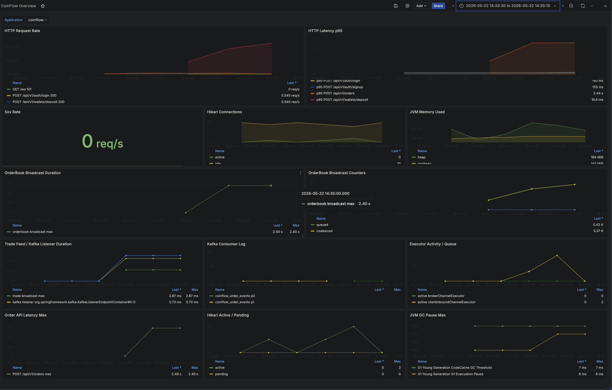
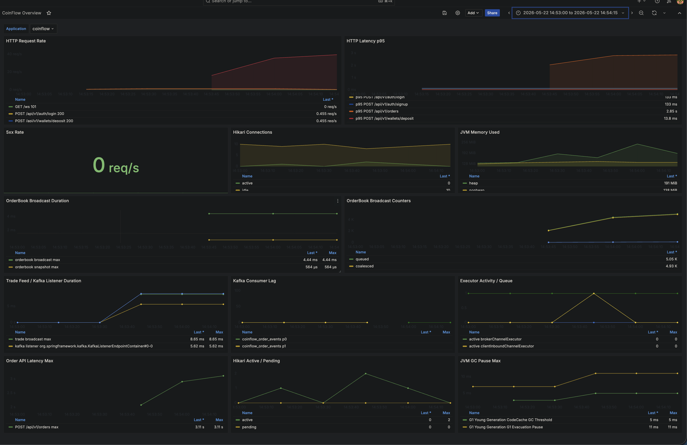
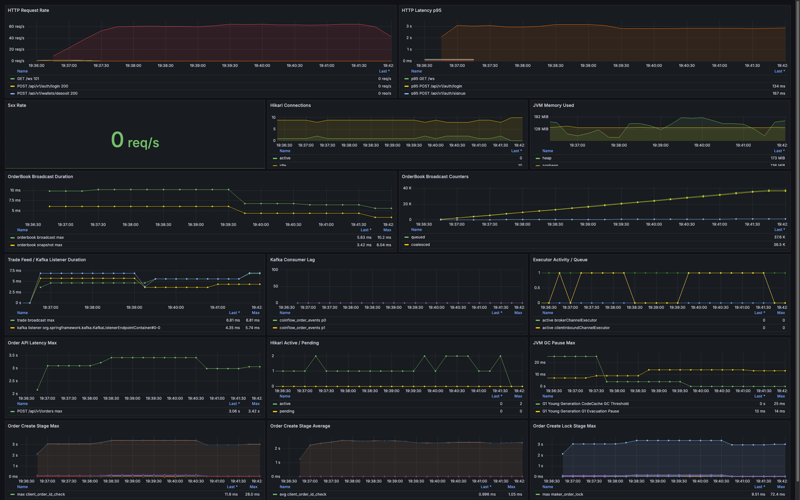
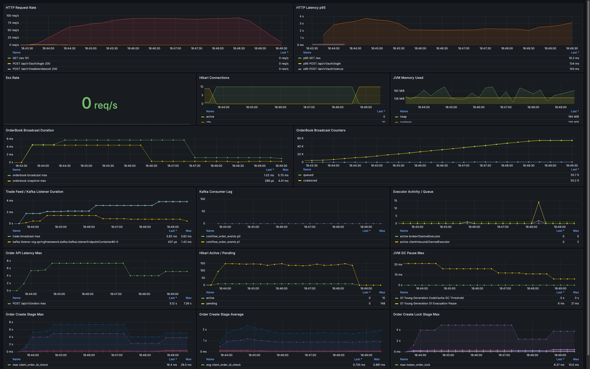

# CoinFlow

개발 사이클에 맞춰 거래 정합성과 실시간 전파 성능을 검증한 암호화폐 거래소 코어 백엔드 프로젝트입니다.

## 프로젝트 개요

| 항목 | 내용 |
|---|---|
| 주제 | 지정가 주문, 가격-시간 우선 매칭, 체결, 지갑 정산, 원장 기록, 실시간 체결/오더북 전파를 구현한 거래소 코어 백엔드 |
| 목표 | 주문과 자산 정합성을 유지하면서 Kafka/WebSocket 기반 외부 전파 경로의 병목을 측정하고 개선 |
| 개발 프로세스 | Phase 1 거래 코어 MVP 구축 -> 정합성/동시성 테스트 보강 -> Phase 2 Outbox/Kafka/WebSocket 도입 -> k6/Grafana 기반 병목 분석과 개선 |
| 핵심 관점 | 기능 구현보다 돈, 잔고, 주문, 체결 상태가 깨지지 않는 구조와 측정 가능한 개선 과정을 우선 |

CoinFlow는 단일 인스턴스 환경에서 주문 생성부터 체결, 지갑 정산, 원장 기록까지 검증합니다. 주문이 체결될 때 `orders`, `trades`, `wallets`, `wallet_ledgers`, `domain_events`가 같은 트랜잭션 경계 안에서 일관되게 기록되는 것을 목표로 합니다.

## 기술 스택

| 영역 | 기술 |
|---|---|
| Language | Java 21 |
| Framework | Spring Boot 3.5, Spring Web MVC |
| Security | Spring Security, OAuth2 Resource Server, JWT |
| Persistence | Spring Data JPA, MySQL 8, Flyway |
| Messaging | Spring Kafka, Kafka |
| Realtime | Spring WebSocket, STOMP |
| Test | JUnit 5, AssertJ, Testcontainers MySQL, Embedded Kafka, k6 |
| Observability | Actuator, Micrometer, Prometheus, Grafana |
| Infra | Docker Compose |

## 서버 아키텍처

```text
Client
  | REST API
  v
Spring MVC Controller
  |
  v
OrderService / WalletService
  |
  v
MatchingEngine + in-memory OrderBook
  |
  v
MySQL
  | orders / trades / wallets / wallet_ledgers / domain_events
  v
Outbox Publisher
  |
  v
Kafka
  |
  v
Kafka Consumer
  |
  v
WebSocket STOMP topics
  | /topic/trades/{market}
  | /topic/orderbook/{market}
  v
Client subscribers
```

핵심 설계:

| 주제 | 설계 |
|---|---|
| Source of truth | DB의 주문, 체결, 지갑, 원장을 기준 상태로 둡니다. |
| 인메모리 오더북 | 매칭 후보 조회와 호가 조회를 위한 파생 상태입니다. |
| 오더북 반영 | DB commit 이후에만 인메모리 오더북을 변경합니다. |
| 순차 처리 | 같은 시장의 주문 생성/취소는 market별 `ReentrantLock`으로 직렬화합니다. |
| DB 동시성 | sequence, wallet, maker order 갱신에 pessimistic lock을 사용합니다. |
| 지갑 모델 | `available_balance`와 `locked_balance`를 분리합니다. |
| 원장 | 모든 지갑 변경을 `wallet_ledgers`에 append-only로 기록합니다. |
| 이벤트 | `domain_events`를 outbox로 사용해 DB commit 이후 Kafka로 발행합니다. |

## 핵심 기능

### 1. 주문, 매칭, 정산 코어

- 지정가 `BUY` / `SELL` 주문 생성
- 가격 우선, 시간 우선 매칭
- 부분 체결, 완전 체결
- 주문 취소
- BUY 주문 quote asset 잠금, SELL 주문 base asset 잠금
- 체결 시 buyer/seller 지갑 정산
- BUY taker 가격 차이 환불
- append-only 지갑 원장 기록
- 서버 시작 시 DB의 미체결 주문으로 인메모리 오더북 초기화

### 2. 조회 API

- 시장 조회
- 오더북 조회
- 최근 체결 조회
- 사용자 fill 조회
- 지갑 조회
- 지갑 원장 조회

### 3. 이벤트 기반 실시간 전파

- 주문/체결/정산 도메인 이벤트를 `domain_events` outbox에 저장
- Outbox Publisher가 DB commit 이후 Kafka topic으로 발행
- Kafka 발행 성공/실패 상태와 재시도 횟수 관리
- Kafka Consumer 기반 WebSocket 실시간 체결 push
- Kafka Consumer 기반 WebSocket 오더북 snapshot push

| 항목 | 값 |
|---|---|
| WebSocket endpoint | `ws://localhost:8080/ws` |
| 체결 feed topic | `/topic/trades/{market}` |
| 체결 예시 topic | `/topic/trades/BTC-KRW` |
| 오더북 feed topic | `/topic/orderbook/{market}` |
| 오더북 예시 topic | `/topic/orderbook/BTC-KRW` |

## 개선 사항

### 1. 거래 정합성 보강

문제 상황:

- MVP 이후 주문/체결 경계 케이스에서 잔고와 오더북 파생 상태가 어긋날 수 있는 위험을 점검했습니다.
- zero-quote 체결, dust maker 잔량, 오더북 반영 실패 후 복구 같은 케이스는 단순 API 테스트만으로는 드러나기 어렵습니다.
- 동일 사용자 동시 주문, 하나의 maker 주문에 대한 동시 taker 체결, 주문 취소와 체결 경합은 잔고 음수나 체결 수량 초과로 이어질 수 있습니다.

해결 방법:

- 지갑 잔고 음수 방지 검증을 공통 정합성 유틸로 분리했습니다.
- 주문/체결/취소 후 `wallets`, `orders`, `trades`, `wallet_ledgers` 상태를 함께 검증했습니다.
- 오더북은 source of truth가 아니라 DB 기반으로 재구성 가능한 파생 상태로 두고, 복구 테스트를 추가했습니다.
- 동시 주문, 동시 체결, 취소/체결 경합 시나리오를 통합 테스트로 고정했습니다.

결과:

- 전체 테스트에서 주문, 체결, 지갑, 원장 정합성 검증을 통과했습니다.
- Phase 1 거래 코어는 Kafka/WebSocket과 분리해도 독립적으로 정합성을 유지하는 기준선을 확보했습니다.
- 이후 Kafka/WebSocket은 거래 트랜잭션의 source of truth를 바꾸지 않는 외부 전파 계층으로 확장했습니다.

### 2. WebSocket/Kafka 실시간 전파 병목 개선

문제 상황:

- `50 subscribers / 50 order/s` 부하에서 WebSocket trade feed p95 지연이 `14.49s`까지 상승했습니다.
- 테스트 종료 시점의 Outbox backlog와 Kafka consumer lag는 `0`이었으나, 테스트 window 안에서는 Kafka Consumer에서 WebSocket broadcast까지의 전파가 밀렸습니다.
- 단순히 Kafka를 붙인 것만으로는 실시간성이 보장되지 않았고, 전파 지연을 별도 지표로 측정해야 했습니다.

해결 방법:

- k6 WebSocket/STOMP 부하 테스트를 추가해 `/topic/trades/{market}`, `/topic/orderbook/{market}` 수신 여부와 trade delivery lag를 측정했습니다.
- WebSocket outbound channel executor를 명시적으로 설정했습니다.
- trade feed와 orderbook broadcast duration, sent count를 Micrometer metric으로 기록했습니다.
- Outbox Publisher 발행 주기와 batch size를 조정해 이벤트 발행 cadence를 개선했습니다.
- 오더북 broadcast는 주문 이벤트마다 full snapshot을 무조건 보내지 않고 coalescing하도록 조정했습니다.

결과:

| Scenario | Before | After |
|---|---:|---:|
| `50 subscribers / 50 order/s` trade lag p95 | `14.49s` | `250ms` |
| `50 subscribers / 50 order/s` trade lag p99 | `15.11s` | `261ms` |
| Kafka consumer lag | `0` | `0` |
| Server errors | `0` | `0` |

### 3. 오더북 브로드캐스트 락 경합 개선

문제 상황:

- `50 subscribers / 100 order/s` 부하에서 `orderbook broadcast duration` max가 `2.40s`까지 상승했습니다.
- 같은 구간에서 Order API latency max도 `2.49s`까지 상승했습니다.
- Kafka consumer lag, Hikari pending connection, 5xx는 모두 `0`이었습니다.
- 따라서 병목은 Kafka backlog나 DB connection pool 고갈이 아니라, 오더북 snapshot broadcast가 주문 생성 경로의 market lock과 경합하는 문제로 판단했습니다.

Before:



해결 방법:

- WebSocket 오더북 브로드캐스트에서 `OrderService` market lock 의존을 제거했습니다.
- `MemoryOrderBook`에 synchronized snapshot API를 추가해 buy/sell side를 짧은 오더북 내부 lock 범위에서 함께 복사하도록 변경했습니다.
- REST 오더북 조회도 동일한 `MatchingEngine.snapshot()` 경로를 사용하도록 정리했습니다.
- `websocket.orderbook.snapshot.duration` metric을 추가해 snapshot 생성 시간과 broadcast 시간을 분리해 관측했습니다.

After:



결과:

| Metric | Before | After |
|---|---:|---:|
| `websocket.orderbook.broadcast.duration` max | `2.4019s` | `4.44ms` |
| `websocket.orderbook.broadcast.duration` sum | `60.617s` | `44ms` |
| `websocket.orderbook.snapshot.duration` max | - | `564us` |
| `ws_trade_delivery_lag` p95 | `2.012s` | `284ms` |
| Kafka consumer lag | `0` | `0` |
| Hikari pending connection | `0` | `0` |
| 5xx | `0` | `0` |
| Order API latency max | `2.49s` | `3.11s` |

인사이트:

- 오더북 브로드캐스트 락 경합은 제거된 것으로 판단했습니다.
- 다만 Order API latency max는 `3.11s`로 남아 있어, 주문 생성 지연의 전체 원인은 아직 해결되지 않았습니다.
- 후속 병목은 주문 생성 트랜잭션의 market lock, DB pessimistic lock, transaction hold time으로 분리했습니다.

### 4. 주문 생성 경로 병목 재분석

문제 상황:

- 오더북 브로드캐스트 락 경합 제거 이후에도 `50 subscribers / 100 order/s` 조건에서 Order API latency가 남았습니다.
- 주문 생성 경로의 `market_lock_wait`, `transaction_template`, DB lock, 오더북 반영 시간을 분리하지 않으면 Kafka/WebSocket 병목과 주문 생성 병목을 구분하기 어려웠습니다.

관측 방법:

- 주문 생성 내부 구간을 Micrometer timer로 분리했습니다.
- `clientOrderId` 사전 중복 조회를 market lock 밖으로 이동하고, DB unique constraint 기반 중복 방어를 유지했습니다.
- 동일 조건을 5분으로 확장해 순간 성능이 아니라 유지 가능한 처리량을 측정했습니다.

Before:



After:



전후 비교:

| Metric | Before | After |
|---|---:|---:|
| Scenario | `50 subscribers / 100 order/s / 5m` | `50 subscribers / 100 order/s / 5m` |
| Created orders | `18,805` | `25,419` |
| Created trades | `9,402` | `12,709` |
| Actual order throughput | `56.56 order/s` | `76.80 order/s` |
| Dropped iterations | `11,196` | `4,582` |
| HTTP failed / 5xx | `0.00%` / `0` | `0.00%` / `0` |
| WebSocket / STOMP errors | `0` | `0` |
| Kafka consumer lag | `0` | `0` |
| Order create p95 / p99 / max | `2.88s` / `3.15s` / `3.48s` | `2.63s` / `3.57s` / `7.35s` |
| Trade delivery lag p95 / p99 | `279ms` / `297ms` | `2.20s` / `3.35s` |
| `market_lock_wait` max | `3.0458s` | `397.38ms` |
| `transaction_template` max | `55.996ms` | `3.7715s` |
| `total` max | `3.0575s` | `5.1223s` |

인사이트:

- `market_lock_wait max`는 `3.0458s`에서 `397.38ms`로 감소했습니다.
- 실제 주문 처리량은 `56.56 order/s`에서 `76.80 order/s`로 증가했고, dropped iteration은 `11,196`에서 `4,582`로 감소했습니다.
- Kafka consumer lag, HTTP 5xx, WebSocket/STOMP error는 모두 0으로 유지됐습니다.
- 후속 병목은 `transaction_template max 3.7715s`로 이동했으며, 주문 생성 트랜잭션 점유 시간과 DB connection pool 대기 가능성을 다음 개선 범위로 분리했습니다.

상세 실행 결과는 [Test Results](.docs/TEST_RESULTS.md)에 기록했습니다.

## 트러블 슈팅

### 1. 성능 테스트 측정값 왜곡 방지

문제 상황:

- 앱 재기동 직후 Kafka/Outbox에 과거 이벤트 backlog가 남아 있으면 첫 실행의 `ws_trade_delivery_lag`가 크게 튈 수 있었습니다.
- 셸 환경의 `DEBUG=release` 값이 Spring Boot debug logging을 활성화해 부하 테스트 결과에 영향을 줄 수 있었습니다.

해결 방법:

- 성능 측정은 `DEBUG=false`로 애플리케이션을 재기동한 뒤 수행했습니다.
- 테스트 종료 시점에 Outbox unpublished event와 Kafka consumer lag를 함께 확인했습니다.
- k6 summary와 Prometheus scrape 원본을 함께 저장해 Grafana 캡처와 수치를 대조했습니다.

## 테스트

전체 테스트:

```bash
./gradlew test
```

k6 부하 테스트:

```bash
k6 run k6/order-flow-load-test.js
k6 run k6/websocket-kafka-load-test.js
```

주요 검증 범위:

- 회원가입, 로그인, JWT 인증
- BUY/SELL 주문 자산 잠금
- 가격 우선, 시간 우선 매칭
- 부분 체결, 완전 체결
- BUY taker 가격 차이 환불
- SELL taker 정산
- 부분 체결 후 취소
- 자기 체결 거절
- 원장 기록
- 오더북 조회
- 도메인 이벤트 저장
- Outbox Publisher Kafka 발행
- Kafka 발행 실패 시 outbox 재시도 상태 전이
- Kafka Consumer 기반 WebSocket 체결 알림
- WebSocket STOMP 실제 수신 E2E
- Kafka Consumer 기반 WebSocket 오더북 snapshot broadcast
- 지갑 잔고 음수 방지
- 동일 사용자 동시 주문 시 잔고 음수 방지
- 하나의 maker 주문에 대한 동시 taker 체결 수량 초과 방지
- 주문 처리 중 오더북 반복 조회 안정성
- 주문 취소와 체결 경합 시 최종 상태 정합성
- k6 기반 주문/조회 API 로컬 부하 테스트
- k6 기반 WebSocket/Kafka 실시간 전파 부하 테스트

## 구현 범위와 제외 범위

구현 범위:

- 회원가입, 로그인, JWT access token 인증
- 사용자별 지갑 자동 생성 및 데이터 분리
- 지정가 `BUY` / `SELL` 주문 생성
- 주문 취소
- 가격 우선, 시간 우선 매칭
- 부분 체결, 완전 체결
- 체결 시 buyer/seller 지갑 정산
- append-only 지갑 원장 기록
- 시장, 오더북, 최근 체결, 사용자 fill, 지갑, 원장 조회
- 서버 시작 시 DB의 미체결 주문으로 인메모리 오더북 초기화
- 주문/체결/정산 도메인 이벤트 로그 저장
- Outbox Publisher 기반 Kafka 이벤트 발행
- Kafka Consumer 기반 WebSocket 실시간 체결 push
- Kafka Consumer 기반 WebSocket 오더북 snapshot push

제외 범위:

- 입금/출금
- 시장가 주문
- IOC/FOK/GTT, post-only, iceberg 주문
- 수수료
- refresh token, OAuth/social login, role/permission
- WebSocket 연결 인증/권한 분리
- Redis, 서버 분리
- replay, redrive, reconciliation
- 관리자 페이지

일부 로컬 개발 편의를 위한 API와 인프라 기반은 존재하지만, 운영 기능 범위와 구분합니다. 예를 들어 dev/test 입금 보조 API는 `prod` 프로필에서 제외됩니다.

## 문서

| 문서 | 설명 |
|---|---|
| [PRD](.docs/PRD.md) | MVP 제품 범위, 포함/제외 기준, 성공 기준 |
| [Plan](.docs/Plan.md) | MVP 구현 순서와 설계 원칙 |
| [Phase 2 PRD](.docs/v2/PRD.md) | Kafka/Outbox/WebSocket 외부 전파 범위와 완료 상태 |
| [Phase 2 Plan](.docs/v2/Plan.md) | Phase 2 구현 계획, 실제 이슈 번호, 후속 범위 |
| [API](.docs/API.md) | REST API 계약과 에러 코드 |
| [ERD](.docs/ERD.md) | 테이블 구조와 관계 |
| [Test Plan](.docs/TestPlan.md) | 핵심 통합 테스트, 동시성 테스트, k6 부하 테스트 계획 |
| [Test Results](.docs/TEST_RESULTS.md) | 동시성/k6 테스트 실행 결과 |
| [Order Flow](.docs/ORDER_FLOW.md) | 주문 생성부터 체결/정산/오더북 반영까지의 내부 흐름 |
| [Issues](.docs/ISSUES.md) | Phase 1 이후 코드 리뷰 이슈와 보강 내용 |
| [Reference](.docs/Reference.md) | 설계 판단 근거와 외부 거래소 API 레퍼런스 |

## 다음 단계

현재 구현 완료 범위는 Phase 1 거래 코어와 Phase 2 이벤트 기반 외부 전파입니다.

- 주문 생성 경로의 market lock 보유 시간 계측
- DB pessimistic lock 대기 시간과 transaction hold time 분리
- WebSocket 연결 인증/권한 분리
- 매칭 엔진 성능 기준선 측정
- 정산 Batch 추가

WebSocket 인증/권한 분리와 Batch 정산은 아직 구현 완료 기능으로 표기하지 않습니다.
