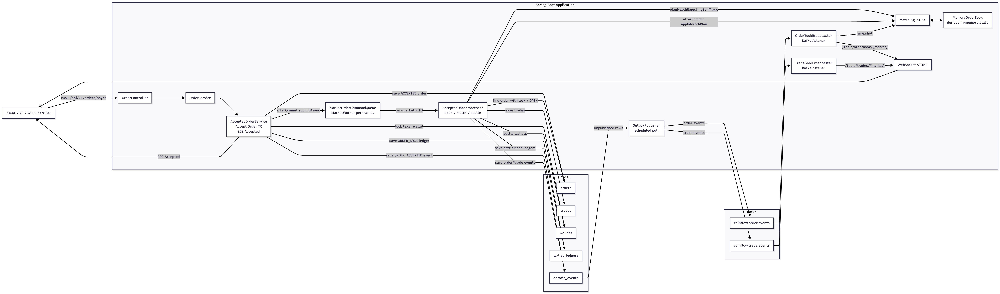
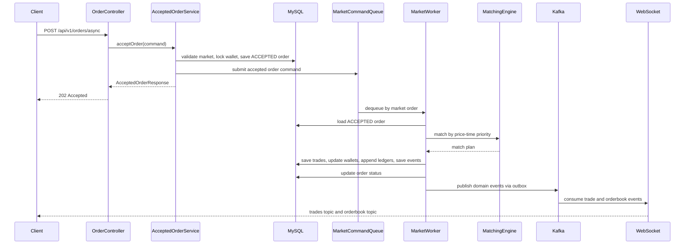
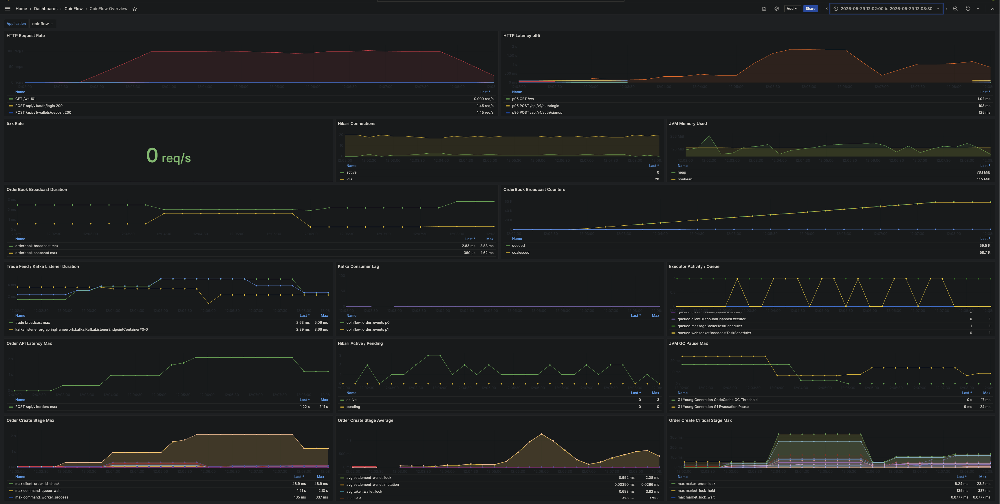
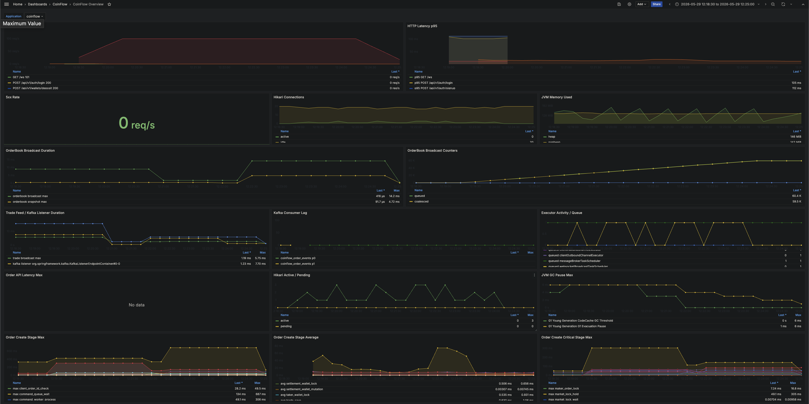

# CoinFlow

지정가 주문, 가격-시간 우선 매칭, 체결, 지갑 정산, 원장 기록, 실시간 체결/오더북 전파를 구현한 거래소 백엔드 프로젝트입니다.

단일 market 주문 처리 경로에서 WebSocket broadcast, market lock, worker queue 병목을 단계적으로 분리했습니다. k6/Prometheus/Grafana 기반 부하 테스트로 병목 후보를 좁히고, 오더북 broadcast lock 의존 제거와 `202 Accepted` 비동기 접수 전환으로 주문 응답 p95를 `1.43s -> 16.34ms`까지 낮췄습니다.

## 핵심 결과

| 지표 | 부하 조건 | Before | After | 확인 내용 |
|---|---|---:|---:|---|
| 주문 응답 p95 | `100 order/s / 5m` | `1.43s` | `16.34ms` | worker 완료 대기와 HTTP 응답 대기 분리 |
| OrderBook broadcast max | `100 order/s / 5m` | `2.4019s` | `4.44ms` | broadcast 경로의 market lock 의존 제거 |
| WebSocket trade feed p95 | `50 order/s` | `14.49s` | `250ms` | Outbox/Kafka 발행 cadence와 WebSocket executor 조정 |
| 실제 주문 처리량 | `100 order/s / 5m` | `56.56 order/s` | `76.80 order/s` | 주문 생성 lock 범위 축소 |

## 문제 접근

- 초기 병목 후보: WebSocket broadcast, Kafka backlog, DB connection pool, market lock, worker queue
- 측정 기준: k6 부하 조건, Prometheus scrape, Grafana 캡처, Kafka consumer lag, Hikari pending, HTTP 5xx, WebSocket/STOMP error 동시 확인
- 개선 순서: 실시간 전파 지연 분리 -> 오더북 broadcast lock 의존 제거 -> 주문 생성 lock 범위 축소 -> HTTP 응답 대기와 worker 완료 대기 분리

## 서버 아키텍처

| 구간 | 역할 |
|---|---|
| API | 동기 주문 생성 `201 Created`, 비동기 주문 접수 `202 Accepted` |
| Queue / Worker | market별 command queue와 worker로 같은 market 주문 순서 보장 |
| Matching | 가격-시간 우선 매칭과 인메모리 오더북 관리 |
| Storage | MySQL에 주문, 체결, 지갑, 원장, 도메인 이벤트 기록 |
| Event / Realtime | Outbox, Kafka, WebSocket STOMP 기반 체결/오더북 전파 |

## 구현 및 검증 기준

| 항목 | 내용 |
|---|---|
| 구현 대상 | 지정가 주문, 가격-시간 우선 매칭, 체결, 지갑 정산, 원장 기록, 실시간 체결/오더북 전파 |
| 정합성 기준 | 주문, 체결, 지갑, 원장이 같은 트랜잭션 경계에서 일관된 상태 유지 |
| 측정 방식 | k6, Prometheus, Grafana로 WebSocket, Kafka, DB connection, market lock, worker queue 병목 후보 분리 |
| 개선 흐름 | 거래 코어 MVP -> 정합성 테스트 -> Kafka/WebSocket 전파 -> 병목 계측 -> 주문 응답 구조 분리 |

## 성능 개선 요약

| 개선 항목 | Before | After | 개선 작업 |
|---|---:|---:|---|
| WebSocket trade feed p95 | `14.49s` | `250ms` | Outbox/Kafka 발행 cadence와 WebSocket 전파 경로 개선 |
| OrderBook broadcast max | `2.4019s` | `4.44ms` | 오더북 snapshot 생성의 주문 생성 market lock 의존 제거 |
| `market_lock_wait` max | `3.0458s` | `397.38ms` | 주문 생성 lock 범위 축소 |
| 실제 주문 처리량 | `56.56 order/s` | `76.80 order/s` | 주문 생성 lock 경합 완화 |
| market worker 처리 평균 | `14.35ms` | `9.73ms` | DB row lock 기반 sequence 발급 제거 |
| 주문 응답 p95 | `1.43s` | `16.34ms` | sync 201 완료 응답을 async 202 접수 응답으로 분리 |
| dropped iterations | `255` | `0` | async 202 동일 조건 부하 기준 |

측정 기준:

- 개선 단계별 동일 시나리오 비교
- async 202 비교 조건: `50 WebSocket subscribers / 100 order/s / 5m / DB pool 20`

## 병목 분석 흐름

| 단계 | 측정 결과 | 개선 작업 | 결과 |
|---|---|---|---|
| 거래 정합성 기준선 | 동시 주문/체결/취소 경합 | 통합 테스트와 공통 정합성 검증 추가 | 잔고 음수, 초과 체결, 오더북 복구 검증 |
| 실시간 체결 전파 | trade feed p95 `14.49s` | Outbox 발행 주기/batch 조정, WebSocket executor 설정 | p95 `250ms` |
| 오더북 broadcast | broadcast max `2.4019s` | market lock 의존 제거, 오더북 내부 snapshot API 추가 | max `4.44ms` |
| 주문 생성 lock 경합 | `market_lock_wait` max `3.0458s` | lock 범위 축소, stage metric 추가 | max `397.38ms` |
| 단일 market worker 한계 | queue depth 증가, worker 평균 처리 `9.73ms` | sequence DB lock 제거, command queue 지표화 | 처리량 일부 개선, backlog 잔여 |
| HTTP 응답 대기 | sync p95 `1.43s` | `202 Accepted` 비동기 주문 접수 경로 추가 | async p95 `16.34ms` |

## 설계 판단

| 판단 지점 | 선택 | 근거 |
|---|---|---|
| 주문 응답 범위 | 기존 `201 Created` API 유지, 신규 `202 Accepted` 접수 경로 추가 | 기존 동기 응답 계약을 유지하면서 worker 완료 대기를 HTTP 응답에서 분리. 동일 조건에서 주문 응답 p95 `1.43s -> 16.34ms`, dropped iterations `255 -> 0` |
| 접수 transaction과 worker 분리 | 접수 transaction은 주문 검증, 자산 잠금, `ACCEPTED` 주문 저장, 원장/이벤트 기록까지만 담당 | `afterCommit` 이후 queue 등록으로 worker가 커밋된 주문만 처리. queue 등록 누락/지연 시 `ACCEPTED` 주문 재조회 후 requeue |
| worker 실패 처리 | 처리 실패 시 `ACCEPTED` 주문을 `REJECTED`로 전이하고 locked asset 해제 원장 기록 | 비동기 처리 실패 후 사용자 자산이 잠긴 상태로 남는 경우 방지 |
| 오더북 broadcast | WebSocket snapshot 생성에서 `OrderService` market lock 의존 제거 | Kafka lag, Hikari pending, HTTP 5xx가 `0`인 조건에서 broadcast duration max `2.4019s` 관측. 오더북 내부 snapshot으로 복사 범위를 제한한 뒤 max `4.44ms` |
| Outbox/Kafka 전파 | 주문 transaction은 domain event 저장까지만 수행하고 Kafka 발행은 Outbox Publisher가 담당 | Kafka/WebSocket 전파 실패가 주문 저장 transaction을 직접 지연시키지 않도록 분리. 측정 시 Kafka consumer lag `0` 기준으로 병목 후보 제외 |

## 비동기 주문 처리 시퀀스

## 개선 사항

### 1. 거래 정합성 보강

확인 범위:

- 주문/체결/취소 경계에서 지갑, 주문, 체결, 원장 상태 일관성
- zero-quote 체결, dust maker 잔량, 오더북 반영 실패 후 복구 경로
- 동일 사용자 동시 주문, 단일 maker 주문 다중 taker 체결, 주문 취소/체결 경합

개선 작업:

- 지갑 잔고 음수 방지 검증을 공통 정합성 유틸로 분리
- 주문/체결/취소 후 `wallets`, `orders`, `trades`, `wallet_ledgers` 상태 동시 검증
- 오더북을 DB 기준으로 재구성 가능한 파생 상태로 정의
- 동시 주문, 동시 체결, 취소/체결 경합 시나리오 통합 테스트 추가

결과:

- 주문, 체결, 지갑, 원장 정합성 검증 통과
- Kafka/WebSocket 외부 전파와 독립적인 거래 코어 기준선 확보
- DB 상태 기준 오더북 복구 경로 검증

### 2. WebSocket/Kafka 실시간 전파 병목 개선

측정 결과:

- `50 subscribers / 50 order/s` 조건에서 WebSocket trade feed p95 `14.49s`
- 테스트 종료 시점 Outbox backlog `0`, Kafka consumer lag `0`
- 지연 구간 후보: Kafka Consumer 이후 WebSocket broadcast 경로

개선 작업:

- k6 WebSocket/STOMP 부하 테스트 추가
- `/topic/trades/{market}`, `/topic/orderbook/{market}` 수신 여부와 trade delivery lag 측정
- WebSocket outbound channel executor 설정
- trade feed, orderbook broadcast duration, sent count Micrometer metric 추가
- Outbox Publisher 발행 주기와 batch size 조정
- 오더북 broadcast coalescing 적용

결과:

| Scenario | Before | After |
|---|---:|---:|
| `50 subscribers / 50 order/s` trade lag p95 | `14.49s` | `250ms` |
| `50 subscribers / 50 order/s` trade lag p99 | `15.11s` | `261ms` |
| Kafka consumer lag | `0` | `0` |
| Server errors | `0` | `0` |

### 3. 오더북 브로드캐스트 락 경합 개선

측정 결과:

- `50 subscribers / 100 order/s` 조건에서 `orderbook broadcast duration` max `2.40s`
- 동일 구간 Order API latency max `2.49s`
- Kafka consumer lag, Hikari pending connection, 5xx `0`
- 제외 후보: Kafka backlog, DB connection pool 고갈

Before:

개선 작업:

- WebSocket 오더북 브로드캐스트의 `OrderService` market lock 의존 제거
- `MemoryOrderBook` synchronized snapshot API 추가
- buy/sell side 복사 범위를 오더북 내부 lock으로 한정
- REST 오더북 조회와 WebSocket snapshot 생성 경로를 `MatchingEngine.snapshot()`으로 통일
- `websocket.orderbook.snapshot.duration` metric 추가

After:

결과:

| Metric | Before | After |
|---|---:|---:|
| `websocket.orderbook.broadcast.duration` max | `2.4019s` | `4.44ms` |
| `websocket.orderbook.broadcast.duration` sum | `60.617s` | `44ms` |
| `websocket.orderbook.snapshot.duration` max | - | `564us` |
| `ws_trade_delivery_lag` p95 | `2.012s` | `284ms` |
| Kafka consumer lag | `0` | `0` |
| Hikari pending connection | `0` | `0` |
| 5xx | `0` | `0` |
| Order API latency max | `2.49s` | `3.11s` |

결과 분석:

- 오더북 브로드캐스트 락 경합 제거
- Order API latency max `3.11s` 잔여
- 후속 병목 후보: 주문 생성 트랜잭션, DB pessimistic lock, transaction hold time

### 4. 주문 생성 경로 병목 재분석

측정 결과:

- 오더북 브로드캐스트 락 경합 제거 이후에도 `50 subscribers / 100 order/s` 조건에서 Order API latency 잔여
- Kafka/WebSocket 병목과 주문 생성 병목의 추가 분리 필요
- 분리 대상: `market_lock_wait`, `transaction_template`, DB lock, 오더북 반영 시간

측정 방법:

- 주문 생성 내부 구간 Micrometer timer 추가
- `clientOrderId` 사전 중복 조회를 market lock 밖으로 이동
- DB unique constraint 기반 중복 방어 유지
- 동일 조건 5분 부하로 유지 처리량 측정

Before:

After:

전후 비교:

| Metric | Before | After |
|---|---:|---:|
| Scenario | `50 subscribers / 100 order/s / 5m` | `50 subscribers / 100 order/s / 5m` |
| Created orders | `18,805` | `25,419` |
| Created trades | `9,402` | `12,709` |
| Actual order throughput | `56.56 order/s` | `76.80 order/s` |
| Dropped iterations | `11,196` | `4,582` |
| HTTP failed / 5xx | `0.00%` / `0` | `0.00%` / `0` |
| WebSocket / STOMP errors | `0` | `0` |
| Kafka consumer lag | `0` | `0` |
| Order create p95 / p99 / max | `2.88s` / `3.15s` / `3.48s` | `2.63s` / `3.57s` / `7.35s` |
| Trade delivery lag p95 / p99 | `279ms` / `297ms` | `2.20s` / `3.35s` |
| `market_lock_wait` max | `3.0458s` | `397.38ms` |
| `transaction_template` max | `55.996ms` | `3.7715s` |
| `total` max | `3.0575s` | `5.1223s` |

결과 분석:

- `market_lock_wait max`: `3.0458s -> 397.38ms`
- 실제 주문 처리량: `56.56 order/s -> 76.80 order/s`
- dropped iteration: `11,196 -> 4,582`
- Kafka consumer lag, HTTP 5xx, WebSocket/STOMP error `0`
- 후속 병목 후보: `transaction_template max 3.7715s`, 주문 생성 트랜잭션 점유 시간, DB connection pool 대기

### 5. 비동기 주문 접수 전환 - HTTP 응답 대기와 worker 완료 대기 분리

측정 결과:

- 동기 주문 생성 API 응답 범위: 잔고 잠금, 매칭, 체결 저장, 지갑 정산, 원장 저장, 이벤트 저장
- market별 command queue 도입 이후 `market_lock_wait` 주요 병목 제외
- `100 order/s` 조건에서 HTTP 응답이 worker queue 대기 시간에 영향
- 제외 후보: Hikari pending, Kafka consumer lag, HTTP 5xx, WebSocket/STOMP error

Sync 201:

개선 작업:

- `POST /api/v1/orders/async` 경로 추가
- 주문 접수 transaction 이후 `202 Accepted` 반환
- 접수 transaction 책임: 주문 검증, 자산 잠금, `ACCEPTED` 주문 저장, 원장 기록
- market worker 책임: 매칭, 체결, 정산, 이벤트 저장
- worker 실패 시 `REJECTED` 상태 전이와 locked asset 해제 보상 추가
- 기존 `POST /api/v1/orders` 동기 API의 `201 Created` 응답 계약 유지

Async 202:

전후 비교:

| Metric | Sync 201 | Async 202 |
|---|---:|---:|
| Scenario | `50 subscribers / 100 order/s / 5m` | `50 subscribers / 100 order/s / 5m` |
| Endpoint | `/api/v1/orders` | `/api/v1/orders/async` |
| Successful order requests | `29,746` | `30,000` |
| k6 reported throughput | `90.62/s` | `91.42/s` |
| Dropped iterations | `255` | `0` |
| Order response p95 / p99 / max | `1.43s` / `1.79s` / `2.11s` | `16.34ms` / `27.16ms` / `278.35ms` |
| Trade delivery lag p95 / p99 / max | `524ms` / `727ms` / `1.02s` | `543ms` / `726ms` / `932ms` |
| HTTP failed / 5xx | `0.00%` / `0` | `0.00%` / `0` |
| WebSocket / STOMP errors | `0` | `0` |
| Kafka consumer lag | `0` | `0` |

잔여 worker 지표:

| Metric | Result |
|---|---:|
| `order.command.queue.depth` max | `58` |
| `command_queue_wait` max | 약 `0.68s` |
| `command_queue_wait` avg | BUY `24.65ms`, SELL `21.79ms` |
| `command_worker_process` avg | BUY `3.60ms`, SELL `12.74ms` |

결과 분석:

- HTTP 응답 p95: `1.43s -> 16.34ms`
- dropped iteration: `255 -> 0`
- 개선 범위: worker 처리량 자체 개선이 아니라 HTTP 응답 대기와 worker 완료 대기 분리
- 잔여 병목: worker backlog, 단일 market worker 처리량 한계

## 현재 한계

- `202 Accepted` 전환은 HTTP 응답 대기와 worker 완료 대기 분리이며, worker 처리량 자체 개선은 아님
- 잔여 지표: `order.command.queue.depth` max `58`, `command_queue_wait` max 약 `0.68s`
- 추가 검증 대상: worker 처리 시간과 queue depth 상관관계, 단일 market worker 처리량 한계

## 트러블 슈팅

### 1. 성능 테스트 측정값 왜곡 방지

측정 결과:

- 앱 재기동 직후 Kafka/Outbox backlog 잔존 가능
- 첫 실행 `ws_trade_delivery_lag` 측정값 왜곡 가능
- 셸 환경 `DEBUG=release`로 Spring Boot debug logging 활성화 가능

개선 작업:

- `DEBUG=false` 기준 애플리케이션 재기동 후 측정
- 테스트 종료 시점 Outbox unpublished event와 Kafka consumer lag 확인
- k6 summary, Prometheus scrape 원본, Grafana 캡처 대조

## 기술 스택

| 영역 | 기술 |
|---|---|
| Language | Java 21 |
| Framework | Spring Boot 3.5, Spring Web MVC |
| Security | Spring Security, OAuth2 Resource Server, JWT |
| Persistence | Spring Data JPA, MySQL 8, Flyway |
| Messaging | Spring Kafka, Kafka |
| Realtime | Spring WebSocket, STOMP |
| Test | JUnit 5, AssertJ, Testcontainers MySQL, Embedded Kafka, k6 |
| Observability | Actuator, Micrometer, Prometheus, Grafana |
| Infra | Docker Compose |
